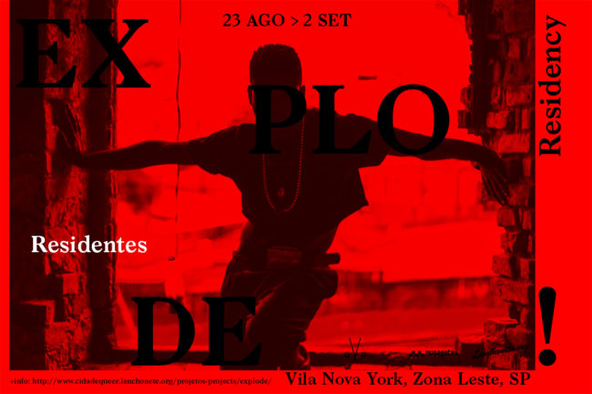
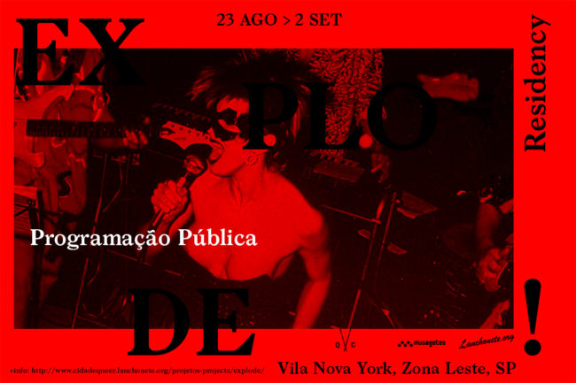

_\*Veja mais no [site do](http://www.explode.life/#residency) [EXPLODE!](http://www.explode.life/#residency)_

Trata-se de um encontro-residência que buscará instaurar um espaço de estudo, experimentação e debate em torno de corpos que escutam, dançam, resistem, manifestam-se e tornam-se visíveis, a partir da experiência e exposição a diferentes tipos de sons e músicas, advindos, principalmente, das periferias.

Propomos uma imersão de onze dias **(entre 23 de agosto e 02 de setembro de 2016)** em uma casa na zona leste de São Paulo, localizada na Vila Nova York, onde morou Cláudio Bueno (cocurador do projeto), até os 22 anos. Nesse local, estará reunida uma comunidade de artistas, músicxs, dançarinxs, agentes culturais e pesquisadores, engajadxs em pensar e apresentar, a partir dessa zona autônoma temporária, as potências desses corpos periféricos urbanos, prontos para assumir o protagonismo e a transformação do mundo atual tomado por retrocessos, conservadorismos e violência.

Estarão conosco, conduzindo nossa experiência de escuta, os integrantes do grupo norte americano [Ultrared](http://www.ultrared.org/). Com uma pesquisa baseada no som e no mapeamento de espaços acústicos como enunciativo de histórias e relações sociais, nos trarão a intensificação da perspectiva política dos sons. Esse grupo de artistas-ativistas, militam por questões raciais, de migração, desenvolvimento participativo de comunidades e criação de políticas HIV/AIDS.

Entre os sons noturnos do bairro – do ladrão de galinhas no telhado ou do tiro seco do trêsoitão –, dançaremos ao som de funk, rap, samba, voguing, waacking, entre outros estilos sonoros de contestação, de resistência e de luta, que potencializam corpos negros, queers, transgêneros, gays, pobres, feministas, etc. Visitaremos espaços da cidade, nos abriremos para o bairro, e estaremos sempre atentos ao som da campainha, por alguém que possa querer estar conosco nessa longa conversa e escuta.

Acreditamos nessa imersão e nesse modo de aprendizagem baseado na escuta, como intensificadores do debate e da explosão de questões urgentes a nós – por meio de longas conversas capazes de potencializar novos encontros, projetos, corpos, afetos, sensibilidades, políticas e ativações para fora dessa situação e localização temporária. Este evento é parte da plataforma Explode!, que pesquisa e experimenta noções de gênero, sonoridades, visualidades e cultura de periferia – em colaboração com Queer City, um projeto de [Lanchonete.org](http://lanchonete.org/) e [Musagetes](http://musagetes.ca).

 

[Conheça a lista de residentes](https://cidadequeer.local//2016/08/03/explode-residency-residentes/)

 

[Confira a programação pública da residência](https://cidadequeer.local//2016/08/05/explode-residency-programacao-publica/)

 

 

_**EXPLODE! Residency** é uma curadoria de_ Cláudio Bueno e João Simões, em colaboração com Queer City, um projeto de [Lanchonete.org](http://lanchonete.org/) e [Musagetes](http://musagetes.ca).

**_Endereço da casa_:** [Rua Itamar Torino, 73, Vila Nova York, São Paulo, SP](https://goo.gl/maps/61CrLwnjoYH2) Seguir localização do link acima. Há dois números "56" na mesma rua

**_Contato_:** claudio.bueno@gmail.com + joaomls@gmail.com

_**Agradecimentos**_: Ligia Nobre, Família Bueno (Sandra, Renata, Ana Paula e Jair), Carolina Godefroid, lista a ser completada.

\_\_\_\_\_\_\_\_\_\_\_\_\_\_\_\_\_\_\_\_\_\_\_\_\_\_\_\_\_\_\_\_\_\_\_\_\_\_\_\_\_\_\_\_\_\_\_\_\_\_\_\_\_\_\_\_\_\_\_\_\_\_\_\_\_\_\_\_\_\_\_\_\_\_\_\_\_\_\_

_**english version**_

_\*See more on the [EXPLODE! site](http://www.explode.life/#residency)._

**EXPLODE! Residency**

_It is a residency-meeting which will seek to establish a space for study, experimentation and debate around bodies that listen, dance, resist, manifest and become visible from the experience and exposure to different types of sounds and music, coming mainly from peripheries._

_We propose a nine-day immersion **(between Aug 23rd and  Sept 2nd)** in a house in the east zone of São Paulo - more precisely, in Vila Nova York – where Claudio Bueno (co-curator of the project) lived until he was 22 years old. The idea is to gather there a community of artists, musicians, dancers and researchers, engaged to think and present, from that temporary autonomous zone, the powers of these urban peripheral bodies that are ready to take a leading and transformative role on this current world we live in taken by many steps back in history, conservative rising and violence – especially in Brazil right now._

_Who will be with us, leading our listening experience, are the members of the sound collective Ultrared. With a sound-based research, mapping acoustic spaces as an enunciation of stories and social relations, they will bring us the intensification of political perspective through sound. This group of artists-activists, fight for racial issues, migration, participatory community development and on the development of HIV / AIDS policies._

_Amidst the night sounds of the neighborhood – the “chicken thief” on the roof or the dry shot of trêsoitão (slang to define a simple weapon) – we will dance to Brazilian funk, rap, samba, voguing, waacking, between other kinds of sound styles of contestation, resistance and struggle, that empower black, queer, trans, gay, poor, migrant, feminist bodies. We will visit spaces of the city, opening ourselves to the neighborhood. We will also be very attentive with the sound of the doorbell, in case anyone would like to join us for our long hearings / conversations._

_We believe that this immersion and this way of learning based on listening, intensifies the debate and the explosion of urgent matters to us – through long talks that will potencialize new meetings, projects, bodies, affections, policies and activations even for outside of this temporary situation and localization. This event is part of the Explode! platform, which researches and experiences notions of gender, sounds, visual arts and culture of the periphery –in collaboration with [Queer City](http://cidadequeer.lanchonete.org), a project by [Lanchonete.org](http://lanchonete.org) and _[Musagetes](http://musagetes.ca)_._ 

 

[Find here the residents of the house](https://cidadequeer.local//2016/08/03/explode-residency-residentes/)!

 

_**EXPLODE! Residency**_

_**Curators:** Cláudio Bueno and João Simões, in collaboration with [Queer City](http://cidadequeer.lanchonete.org) and [Lanchonete.org](http://lanchonete.org/) – sponsored by [Musagetes](http://musagetes.ca)._

**Address:** [Rua Escânio Cerqueira, 56, Vila Nova York, São Paulo, SP](https://goo.gl/maps/61CrLwnjoYH2)

**Contact:** claudio.bueno@gmail.com + joaomls@gmail.com

_Photo by: Carol Godefroid_
