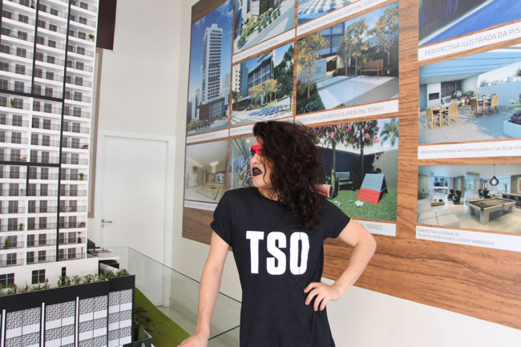

#### projeto da residência de Jean François-Prost

**texto** Raphael Daibert  

“Esses novos acrônimos serão em defesa das causas marginais, de atitudes de vidas urbanas alternativas. A ideia é que reflitam a precariedade ou a ausência de alguma particularidade nos espaços públicos, subvertendo uma marca ou sigla de uma empresa lucrativa (como KFC, CVC etc). É criar um espaço de novas siglas e acrônimos que defendam diferentes direitos na cidade”. Assim Jean-François Prost, artista canadense proveniente do Québec começa a explicar seu processo de pesquisa em São Paulo, durante uma residência de três meses em 2016 com a plataforma Lanchonete.org, dentro do programa Cidade Queer.

Seu projeto intitulado Acronymia tomou forma anteriormente na Bienal de Liverpool, em 2006. Por meio de diversos eventos, em diversos locais e com um público variado em cada um deles, uma versão do projeto artístico se realizou em São Paulo durante os meses do artista na cidade.  

**fotos** Jean-François Prost, **modelos** Lua Lucas  

Com o intuito de explorar uma linguagem além da comercial normalmente utilizada quando são empregadas as siglas, esses novos acrônimos não convencionais foram criados a partir de diversos encontros com diferentes artistas e pessoas do meio da arquitetura, da antropologia, geografia urbana, performance etc. Em parceria com o projeto desenvolvido no Ponto Aurora, intitulado Laboratório Gráfico Desviante, certas “acronímias” indecifráveis foram tomando forma progressivamente, trazendo consigo algum significado relacionado ao espaço público, às relações das pessoas com a cidade.

Jean-François Prost, em colaboração com outros parceiros como o Festival Cocidade ou o projeto Zona da Mata(hyperlink) confeccionou camisetas – uma vez no quintal do Goethe-Institut São Paulo e outra em um domingo no Minhocão – nas quais as “acronímias” foram impressas para que fossem performadas pela cidade por quem as usasse. A ideia de levar essas siglas desconhecidas, como a TSO (Trans Sem Oportunidade) ou GGG (Gays Gentrificam Gays), pelas ruas é que se crie um diálogo entre desconhecidos pela curiosidade de entender o que aquilo significa. “Por defender uma pluralidade urbana na qual pontos de vista minoritários devem ser trazidos à tona é o motivo de termos impresso coletivamente estes símbolos em camisetas”, defende o artista.
