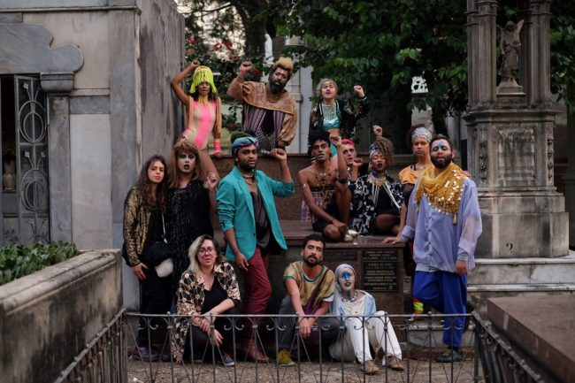
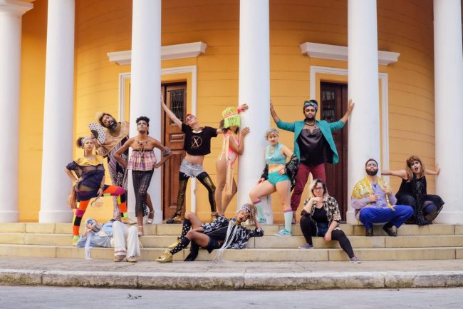
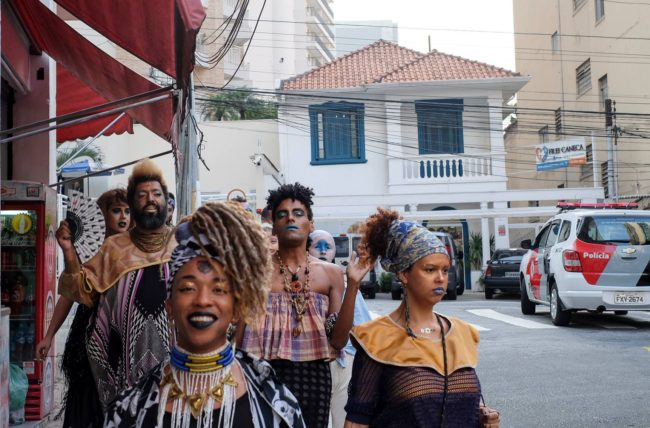

**texto** Claudio Bueno e João Simões **fotos** Carol Godefroid

“Hamba Kahle Mkhonto Mkhonto Mkhonto we Sizwe Hamba Kahle Mkhonto Mkhonto Mkhonto we Sizwe”1

  
Como parte da oficina “A Revolta do Arco-íris”2, liderada pelo grupo sul-africano Umlilo & Stash Crew, caminhamos por ruas do centro da cidade de São Paulo, até o Cemitério da Consolação, onde encontra-se o jazigo de Andréa de Mayo, ativista dos direitos de travestis e transexuais. Morta em 2000 por complicações posteriores a uma cirurgia para retirada de silicone industrial de seu corpo, a ativista foi impedida de ser sepultada no mesmo jazigo de sua família, sendo então acolhida em outro espaço, cedido pelo amigo e guia espiritual Walter Alegrio – ou Pai Walter de Logun Edé. Até 2016, somente seu nome de registro constava em sua lápide, quando, por iniciativa do Serviço Funerário do Município de São Paulo, houve a retificação e o acréscimo da placa doado pelo professor e arquiteto Renato Cymbalista, que passou a apresentar seu nome social3.

 

Se nas últimas décadas, Andréa lutou para que as populações LGBTQ+ tivessem seus direitos garantidos, assim como o direito de não terem seus corpos violados, é notória a necessidade de continuidade dessa luta – haja vista a estranheza e os comentários agressivos ouvidos por esse grupo durante o trajeto.

Essas pessoas, maquiadas, travestidas, estranhas, afeminadas, masculinizadas, não-binárias, _queers_, pretas, brancas, amarelas, enviadecidas, sapatões etc, andaram juntas pelas ruas, a despeito de um sistema que visa normatizar a conduta de corpos em todas as esferas sociais. Mas caminharam também, em respeito e celebração a pessoas como Andréa de Mayo, que participaram ativamente da abertura, fortalecimento e multiplicação desses modos de existir outros. Num país recordista em assassinatos e violência de LGBTs, ainda é preciso lembrar e cantar por pessoas como Andréa, bem como por todxs xs travestis e transexuais brasileirxs e do mundo.

 

Umzabalazo!

 

\_\_\_\_\_

**notas**

1 **Tradução livre para** **_Hamba Kahle Mkhonto we Sizwe_****:** em Inglês: _Go well Spear of the Nation_. Em Português: Siga bem, Lança da Nação. Essa foi a música cantada no funeral de Nelson Mandela, e se refere a um cântico de luta em homenagem ao grupo _Spear of the Nation_, movimento sul-africano formado em 1961 e que lutou contra o regime do Apartheid no país até no ano de 1990. O grupo cantou essa música durante a homenagem para Andréa de Mayo.

2 **A Revolta do Arco-íris:** Oficina que aconteceu entre os dias 1 e 5 de maio de 2017, no Sesc Santana, em São Paulo, com curadoria da plataforma Explode!, liderada por Cláudio Bueno e João Simões. Essa caminhada, que aconteceu no dia 2 de maio, contou com o apoio da plataforma Lanchonete.org, liderada por Raphael Daibert e Todd Lester. O grupo saiu do Teatro Cemitério de Automóveis, parou no Conjunto Santos Dumont (conhecido também como Treme Treme do Bixiga, na rua Paim), e seguiu até o Cemitério da Consolação.

3 **Sobre a retificação do nome e outras ações em torno da lápide de Andrea de Mayo, leia também**: “A vez de Andrea, Sobre o direito de morrer como travesti”, por Armando Antenore, na revista Piauí: <[http://piaui.folha.uol.com.br/materia/vez-de-andrea/](http://piaui.folha.uol.com.br/materia/vez-de-andrea/)\> e “Ossanha de Mayo”, ato performativo realizado pelo Coletivo Viadas, em 2016, disponível no portal Democratize:  <[http://democratizemidia.com.br/16-anos-apos-seu-falecimento-transexual-recebe-placa-com-nome-social-em-seu-tumulo](http://democratizemidia.com.br/16-anos-apos-seu-falecimento-transexual-recebe-placa-com-nome-social-em-seu-tumulo/)\>.
