### Programação pública / Public Program

Entre os dias 23 de agosto e 02 de setembro, a [Explode! Residency](https://cidadequeer.local//projetos-projects/explode/) realizará, além dos encontros fechados entre os [residentes](https://cidadequeer.local//2016/08/03/explode-residency-residentes/), uma série de atividades abertas. Confira a agenda, programe-se e esteja conosco!

Todos os eventos são gratuitos e acontecerão na casa da residência, localizado na Rua Itamar Torino, 73, Vila Alzira (conhecida como Vila Nova York).

 

Resumo da programação

[23 de agosto](#meuamigoclaudia), cinema, às 19h, "Meu Amigo Cláudia", de Dácio Pinheiro, seguido de conversa com Aretha Sadick e Duda Babaloo [25 de agosto](#periferias), projeções e falas, às 19h, Corpos e Periferias, com Renata Martins, Ezio Rosa e Jota Mombaça [26 de agosto](#juliana), das 10h às 12h, gravação de video-performance, seguida de conversa com a artista Juliana Santos e sua avó [27 de agosto](#janta), a partir das 13h, almoJANTA #7 – comida queer, cidade queer. [27 de agosto](#explode), das 10h às 21h, Mostra Explode! Queer Rap – Exibição de videoclipes de músicos que tem se mesclado à cena do rap (frequentemente machista e lgbtqfóbica), redesenhando esse circuito. Esses rappers, localizados em diferentes partes do mundo, criaram hoje um novo contexto que tem sido reconhecido, ainda que não completamente delimitado, como Queer Rap. 27 de agosto, das 11h às 13h, Fala "Semana da Visibilidade Lésbica". Organizada por Camila Furchi, a fala irá acontecer na Unidade Móvel do Centro de Cidadania LBGT Laura Vermont, estacionada em frente à casa. [27 de agosto](#workshop), a partir das 15h, Introdução à cultura ball norte americana com Michael Roberson, seguido de workshop de waack, vogue e stiletto com o Legendary Pony Zion (NYC), Felix Pimenta, Danna Lisboa, projeto Diana e convidados. No som: Tiago Guiness. [28 de agosto](#batalha), Batalha Explode! de vogue, com Pony Zion, Felix Pimenta, Danna Lisboa, projeto Diana (Danila Bustamante, Flávio Franzosi e Tiago Guiness) e demais convidados. Essa programação estará aberta a todxs xs interessadxs nas batalhas! Esteja preparadx! [29 de agosto](#pierre), às 15h, Conversa: "Trânsito", com Pierre-Michel, Jean;  "Não vamos obedecer", com Daniel Lima e "Afrotranscendence", com Diane Lima [30 de agosto](#politica), às 15h, Debate: Políticas Queer, com Cadu Oliveira/Revolta da Lâmpada, Elvis Stronger/Família Stronger, Camila Furchi e Salete Campari/Centro de Cidadania LGBT de São Miguel Paulista e Elida Lima (Cursinho Popular Transformação e #partidA) [30 de agosto](#sphifi), às 19h, "São Paulo em Hi-Fi", do diretor Lufe Stefen [31 de agosto](#aretha), às 15h, Apresentação dos processos de VESTIRCORPONÚ = EXPLOSÃO, de Aretha Sadick e convidados. [01 de setembro](#pedagogia), às 17h, Conversa, Propostas para uma Pedagogia Queer, com Tainá Azeredo, da Intervalo-Escola; Michael Roberson, do coletivo Ultra-red; Eda Luiz, do CIEJA Campo Limpo; e Shawn Van Sluys, falando sobre Free Home University. [02 de setembro](#bruno), 12h, Performance de encerramento, com Bruno Mendonça

 

 

Programação detalhada

 

23 de agosto, cinema, às 19h _August, 24st, cinema, 7pm_

 

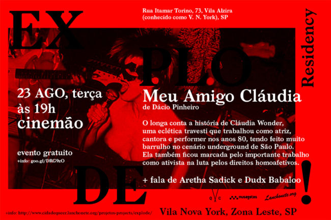

"Meu amigo Cláudia", 1h20, do diretor Dácio Pinheiro _"My friend Cláudia", 1h20, direction: Dácio Pinheiro_

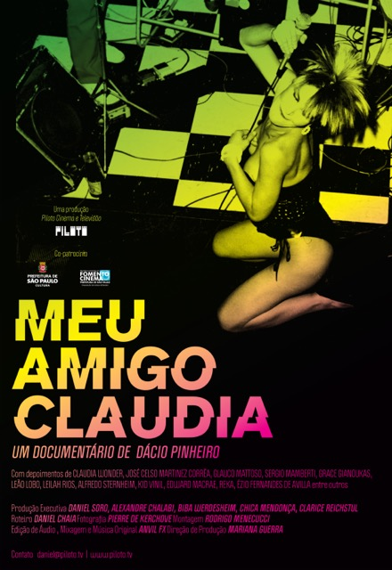

O longa conta a história de Cláudia Wonder, uma eclética travesti que trabalhou como atriz, cantora e performer nos anos 80, tendo feito muito barrulho no cenário underground de São Paulo. Ela também ficou marcada pelo importante trabalho como ativista na luta pelos direitos homoafetivos.

The film's purpose is to make known questions about pop culture, behavior, politics and sexual diversity. Through the main character, the transvestite Claudia Wonder, we will follow what happened in the city of Sao Paulo in the 70's, 80's, 90's and 2000's. She broke through prejudice and were able to take the transvestites away from the police columns to the cultural pages of newspapers and magazines, participating in many productions of the Brazilian Erotic Cinema, being part of a punk band and also participating in many plays, as much as how she got involved in the intellectual and political field becoming an important representative in governments organizations of assistance and protection to homosexuals in the spotlight of prejudice.

Após o filme haverá uma conversa com as performers [Duda Babaloo](https://www.facebook.com/dudxdxdx?fref=ts) e [Aretha Sadick](https://www.facebook.com/aretha.sadick?fref=ts). After the film, a conversation with the performers [Duda Babaloo](https://www.facebook.com/dudxdxdx?fref=ts) e [Aretha Sadick](https://www.facebook.com/aretha.sadick?fref=ts).

https://www.youtube.com/watch?v=tXUdqOJgjZo

 

[voltar para o topo](#topo)

 

25 de agosto, projeções e falas, às 19h August, 25th, Screenings & Talks, 7pm

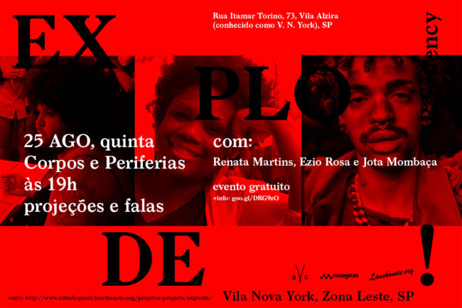

Corpos e Periferias _Bodies and Peripheries_

Com _With_

**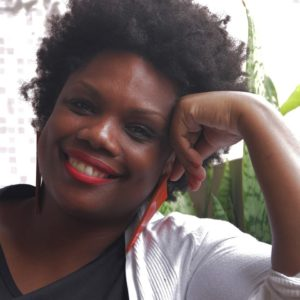Renata Martins** é cineasta formada pela Universidade Anhembi Morumbi e Pós Graduada em linguagens da arte pela USP. Tem como uma de suas preocupações centrais a construção da imagem das mulheres negras. Nesse sentido, idealizou e produziu, junto com a cineasta Joyce Prado, a websérie [Empoderadas](https://www.facebook.com/programaempoderadas), que conta histórias de mulheres negras empoderadas, das mais variadas áreas de atuação.

 

**Jota Mombaça**, 1991. Ensaísta e Performer. É uma bicha não binária, racializada como parda, nascida e criada no Nordeste do Brasil, que escreve, performa e faz estudos acadêmicos em torno das relações entre monstruosidade e humanidade, estudos kuir, giros descoloniais, interseccionalidade política e tensões entre ética, estética, arte e política nas produções de conhecimentos do sul-do-sul globalizado.

Assista o [vídeo](https://www.youtube.com/watch?v=LQTrdaoAtGM) com a fala dx performer, entre 4:21 e 4:52.

**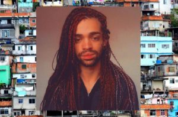Ézio Rosa** é educador, integra o bloco afro Ilu Obá de Min e escreve o [blog Bicha Nagô](http://bichanago.tumblr.com), no qual relata experiências de pessoas gays e negras nas periferias, frente à elitização da cultura LGBTQ. Leia seu texto "[Ser gay no RAP](http://bichanago.tumblr.com/post/98921378961/ser-bicha-no-rap)".

 

 

[voltar para o topo](#topo)

 

26 de agosto, gravação de video-performance, seguida de conversa com a artista, das 10h às 12h, com **Juliana Santos** Para participar desta conversa, escreva pra gente: claudio.bueno@gmail.com + joaomls@gmail.com

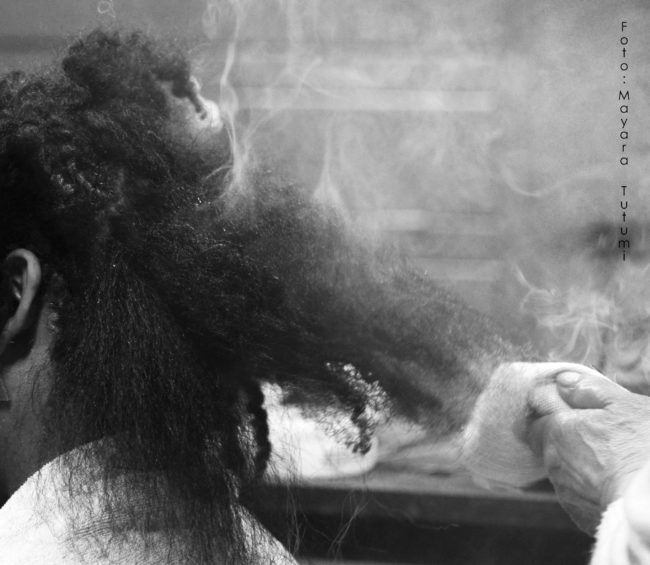

Um pente de ferro na boca do fogão e um pouco de vaselina. Era essa a receita para os cabelos de muitas mulheres negras, há algumas poucas décadas passadas. Quando menina o cheiro de cabelo queimado vinha da cozinha. Era na cozinha que as mulheres lá de casa cuidavam de suas madeixas, era no liso que não era nosso que deveríamos ostentar o insustentável com qualquer ruído de umidade do ar. E eu contudo, fui poupada de tal processo, esta foi a primeira vez em que me submeti a este processo. O cabelo, o limite. Realizar o desejo de minha família. Ter o cabelo alisado pela minha avó materna, Benedicta ou minha mãe, Eliana, com o pente de ferro quente. Com intuito de alterar a plasticidade dos fios com técnica violenta e incisiva e, ao final, desfazer o processo com um com o chá da erva denominada Carqueja. Erva com a qual minha Vó Dita (avó materna) sempre utililizou no tratamento de nossos cabelos como tonificante capilar e fortelecedor das raízes.

 

[voltar para o topo](#topo)

 

27 de agosto

a partir das 13h, [almoJANTA #7](https://cidadequeer.local//projetos-projects/janta/) – comida queer, cidade queer

É um jantar que ocorre regularmente na casa do ator Paulo Goya, no Casarão Belvedere, em São Paulo. Nesta edição acontecerá na zona leste, dentro da residência Explode!, em sua versão almoJanta, com início às 13h. Nesses encontros, baseados em conversas e performances, são abordados diversos temas relativos às noções de _queer_ hoje. Liderados por Thiago Carrapatoso, nesse dia seremos recebidos para comer e dançar, acompanhados de batalhas de dança (conforme detalhes a seguir).

Os jantares, gratuitos, contarão com convidadxs. Nosso orçamento é de um jantar para 30 pessoas, então, pedimos para que xs participantes tragam outros pratos para dividir e complementar. O mesmo para as bebidas: traga a sua e mais algumas para compartilhar. Assim, se garante que todo mundo possa comer e beber.

 

das 11h às 13h, Fala "Semana da Visibilidade Lésbica". Organizada por Camila Furchi e convidadas, a fala irá acontecer na Unidade Móvel do Centro de Cidadania LBGT Laura Vermont, estacionada em frente à casa.

 

**Camila Furchi** é militante da Marcha Mundial das Mulheres e faz parte da equipe do Centro de Cidadania LGBT Laura Vermont.

 

[voltar para o topo](#topo)

 

a partir das 15h, Conversa sobre a cultura ball norte americana com Michael Roberson, seguido de workshop de waack, vogue e stiletto com o Legendary Pony Zion (NYC), Felix Pimenta, Danna Lisboa, projeto Diana e convidados. No som: Thiago Guiness. (Evento gratuito. Vagas limitadas para o workshop e as batalhas. Confirme sua presenção no email: exploderesidency@gmail.com)

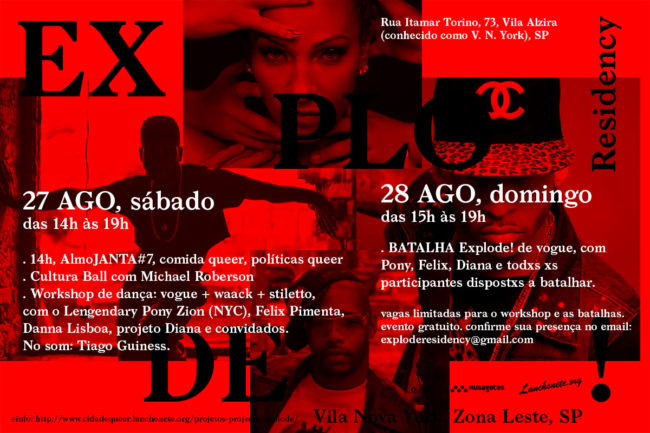

 

[voltar para o topo](#topo)

 

28 de agosto, a partir das 15h, Batalha Explode! de vogue com o Legendary Pony Zion Garcom, Felix Pimenta, Danna Lisboa, Projeto Diana (Danila Bustamante, Flávio Franzosi e Tiago Guiness) e demais convidados. No som: Tiago Guiness. Essa programação estará aberta a todxs que queiram participar das batalhas! Esteja preparadx! (Evento gratuito. Vagas limitadas para o workshop e as batalhas. Confirme sua presenção no email: exploderesidency@gmail.com)

[Pony Zion](https://cidadequeer.local//2016/08/03/explode-residency-residentes/)

 

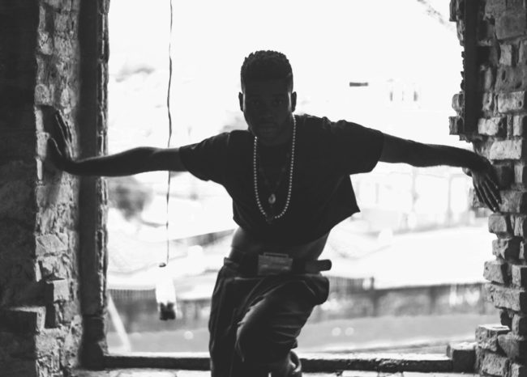 [Felix Pimenta](https://cidadequeer.local//2016/08/03/explode-residency-residentes/)

 [Danna Lisboa](https://cidadequeer.local//2016/08/03/explode-residency-residentes/)

 

[Tiago Guimarães](https://cidadequeer.local//2016/08/03/explode-residency-residentes/)

 

 

 

 

 

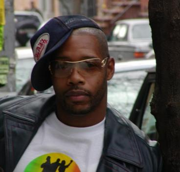 [Michael Roberson](https://cidadequeer.local//2016/08/03/explode-residency-residentes/)

 

 

 

 

 

 

 

[Projeto Diana](https://www.facebook.com/dianaafesta/?fref=ts)

 

 

 

 

 

das 10h às 21h, Mostra Explode! Queer Rap. 

Desde o final dos anos 90, especialmente nos Estados Unidos, uma série de artistas da música tem se mesclado à cena do rap (frequentemente machista e lgbtqfóbica) redesenhando esse circuito. Criam assim um novo contexto que tem sido reconhecido, ainda que não completamente delimitado, como Queer Rap. Suas referências são contaminadas pela cultura visual, sonora, tecnológica e comportamental de toda a segunda metade do século XX, misturando inúmeros mundos, como: o cinema, o videogame, o basquetebol, os desenhos animados, a moda, o pop, a periferia, entre tantos outros. Apostam novamente na estética do videoclipe e seus efeitos de pós-produção, como força expressiva das mais potentes no contemporâneo. Em suas coreografias, performam como manos incorporados em divas e vice-versa. Cláudio Bueno e João Simões selecionaram para essa mostra uma série de videoclipes dessxs rappers.

https://www.youtube.com/watch?v=NIgLsHMWCsI

no vídeo acima, Rico Dalasam, que integra essa mostra baseada em videos no YouTube.

 

o encontro de dança iniciado no dia 27, seguirá com xs mesmxs performers no dia 28 de agosto

 

[voltar para o topo](#topo)

29 de agosto, às 15h, Conversa: "Trânsito", com Pierre-Michel, Jean; "Não vamos obedecer", com Daniel Lima e "Afrotranscendence", com Diane Lima

 

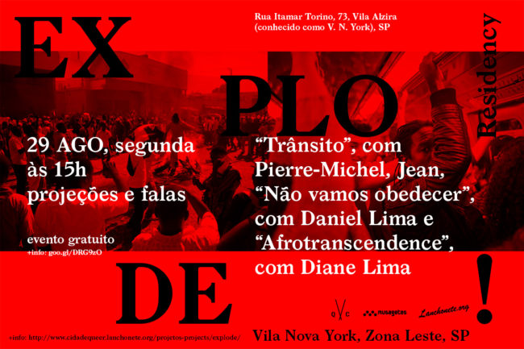

 

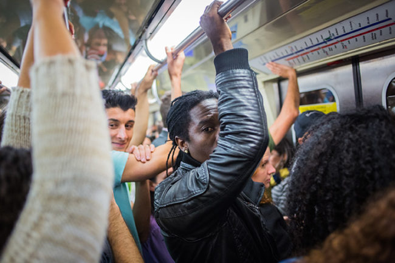

TRANSIT / Trânsito Desencantamento, a principal razão a qual leva uma grande massa de pessoas a vir para o Brasil há 5 anos, que os impulsiona ainda hoje e desde quando deixaram seu país. Trabalho e crescimento econômico são duas coisas que hoje em dia falta na sexta maior potência mundial e os imigrantes são os primeiros a serem afetados. Nos bairros de imigrantes há quase uma competição de quem deixará o Brasil primeiro. Pretende-se fazer um relato da vida destes imigrantes antes de sua partida.

**Pierre-Michel Jean**. Fotojornalista, vive e trabalha em Porto Príncipe, Haiti. No curso de seus estudos em Comunicação Social descobre a fotografia que virá a estudar mais tarde. Participou de diversos cursos de fotografia com fotógrafos como Dave Damoison, Gaël Turine, Chéry Dieu Nalio, Paolo Woods. Em 2013, foi selecionado para representar o Haiti nos Jogos da Francofonia em Nice, na França. Pierre-Michel já expôs suas fotos em diversas exposições coletivas tanto no Haiti quanto no exterior.

 

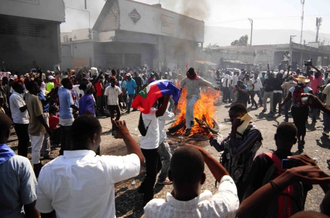

NOU PAP OBEYI não vamos obedecer Nou Pap Obeyi (Não Vamos Obedecer) é um documentário criado a partir da pesquisa sobre as experiências de militarização e controle social atualmente ocorrendo na América. Porto Príncipe simboliza a luta quilombola transcontinental. Hoje, o Haiti é um país praticamente invisível no capitalismo financeiro. Um isolamento a que foi condenado quando abriu a sequência de independências das Américas. Um país negro fruto de uma revolução escrava. Como podemos criar uma narrativa que revele a potência desta história de resistência? O filme Nou Pap Obeyi é o último capítulo da investigação que já passou por cidades como São Paulo, Rio de Janeiro, Medellín, Havana, Nova Iorque e Baltimore.

Comissionado por Otis College of Art & Design Getty Foundation

**Daniel Lima**. Bacharel em Artes Plásticas pela Escola de Comunicação e Artes da USP e Mestre pelo Núcleo de Estudos da Subjetividade da PUC/SP, desde 2001 cria intervenções e interferências no espaço urbano. Próximo de trabalhos coletivos, desenvolve pesquisas relacionadas a mídia, questões raciais e processos educacionais em quatro diferentes grupos: "A Revolução Não Será Televisionada", "Frente 3 de Fevereiro" e "Política do Impossível" . Dirige a produtora e editora Invisíveis Produções.

http://www.danielcflima.com/ https://issuu.com/invisiveisproducoes

 

[caption id="attachment\_1222" align="alignleft" width="200"\]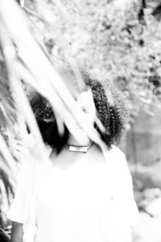 Foto de Alile Dara Onawale[/caption]
AFROTRANSCENDENCE

Dirigida por Yasmin Thayná e escrita por Diane Lima, a série de 12 capítulos discute racismo, memória, práticas artísticas e as necessidade de produzirmos conhecimento como ato político.

**Diane Lima** é pesquisadora, curadora e diretora criativa. Especializou-se em Arte e Contemporaneidades e é mestranda em Comunicação e Semiótica na PUC-SP onde pesquisa a produção de sentido nas práticas artísticas contemporâneas afro-brasileiras. Como diretora criativa do NoBrasil, uma plataforma de pesquisa e experimentos curatoriais, desenha e co-cria ações e projetos como o AfroTranscendence, um programa de imersão em processos criativos que acontece pelo segundo ano no Red Bull Station. É uma das curadoras do Festival de Cinema Africano do Vale do Silício e dos Diálogos Ausentes, projeto do Itáu Cultural que discute a presença dxs negrxs nas mais diferentes formas de expressão. [http://nobrasil.co](http://nobrasil.co/)

 

[voltar para o topo](#topo)

 

30 de agosto

às 15h, Políticas queer

 

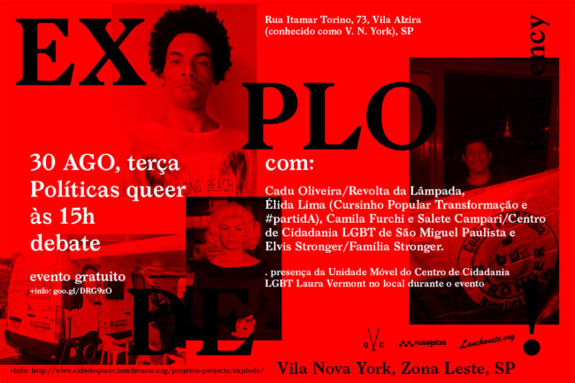

com: [Cadu Oliveira/Revolta da Lâmpada](https://www.facebook.com/arevoltadalampada/), Elida Lima ([Cursinho Popular Transformação](https://www.facebook.com/CursinhoPopularTransformacao/) e #partidA), Camila Furchi e Salete Campari/ [Centro de Cidadania LGBT de São Miguel Paulista](http://www.prefeitura.sp.gov.br/cidade/secretarias/direitos_humanos/lgbt/cch/index.php?p=150960)  e Elvis Stronger/[Família Stronger](https://www.facebook.com/familiastronger/?fref=ts).

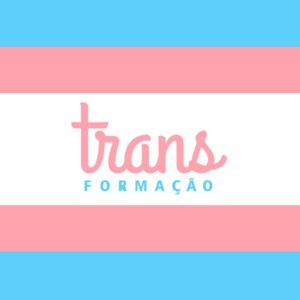 **Élida Lima** é escritora, editora e professora. Atua junto ao [Cursinho Popular Transformação](https://www.facebook.com/CursinhoPopularTransformacao), voltado à educação empoderadora para pessoas transexuais e travestis em São Paulo.

 

**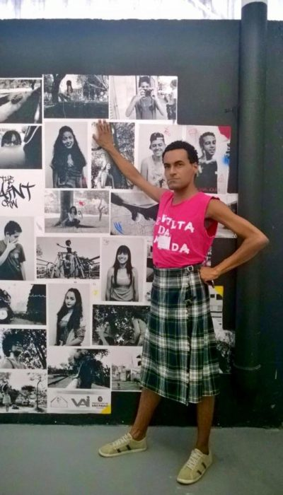**

 

**Cadu Oliveira** é envolvido com ações de voluntariado desde 1996. Hoje é militante nos coletivos [A Revolta Da Lâmpada](https://www.facebook.com/arevoltadalampada) e Cume. Também fez parte da produção da Conferência [SSEX BBOX\]. Mediou e compões mesas de debate na UNIP Jundiaí, FESP, Casper Líbero e USP. [A Revolta Da Lâmpada](https://www.facebook.com/arevoltadalampada) começou como uma manifestação pelo corpo livre, em novembro de 2014: descentralizada, desinstitucionalizada, coletiva, criativa, independente e com equilíbrio de protagonismo entre corpos. O ponto de partida: paulista 777, o local dos ataques de lâmpada que agrediram violentamente pessoas LGBT e também heterossexuais cis, após qualificarem o comportamento de seus corpos como inadequados.

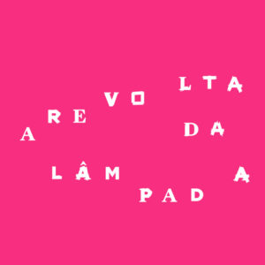A Revolta da Lâmpada luta pelo corpo livre e acredita que fervo também é luta.

LUTA: organizamos ações políticas pragmáticas, com pauta clara de reinvindicações para: população LGBT, mulher e minorias criminalizadas FERVO: um espaço de livre expressão artística e de gênero, onde se luta pelo direito de um corpo livre ao mesmo tempo em que se vive e o celebra.

 

**Elvis Stronger,** São Paulo, 1986, zona sul. Integra o conselho da [família stronger](http://www.facebook.com/familiastronger) ,um grupo de jovens que atuam por igualdade, principalmente de gênero e racial, buscando focar suas ações no segmento político social e o consequente fortalecimento das populações LGBT. Elvis também é coordenador do cine diversidade no Grajaú, na zona sul de São Paulo. Atualmente faz parte de um grupo de trabalho de prevenção contra DSTS voltado para a juventude!

 

Os **[Centros de Cidadania LGBT](http://www.prefeitura.sp.gov.br/cidade/secretarias/direitos_humanos/lgbt/cch/index.php?p=150960)** – fazem parte das ações do Programa de Metas da Gestão 2013/2016 da Prefeitura de São Paulo, previsto na Meta 61: _desenvolver ações permanentes de combate à homofobia e respeito à diversidade sexual._ Os Centros são iniciativas da Secretaria Municipal de Direitos Humanos e Cidadania, por meio da Coordenação de Políticas para LGBT, realizada em parceria com a Secretaria de Direitos Humanos da Presidência da República. Inaugurados em 2015 (Arouche) e 2016 (Zona Sul e Zona Leste), os centros atuam a partir de dois eixos: 1) **Defesa dos Direitos Humanos**: atendimento a vítimas de violência, preconceito e discriminação. Prestação de apoio jurídico, psicológico e de serviço social, com acompanhamento para realização de boletins de ocorrência e demais orientações. 2) **Promoção da Cidadania LGBT**: suporte e apoio aos serviços públicos municipais da região central, por meio de mediação de conflitos, palestras e sensibilização de servidores. Realização de debates, palestras e seminários. O centro é coordenado por **[Salete Campari](https://www.facebook.com/oficial.camparisalete)**, uma das mais icônicas figuras da noite paulistana, uma referência da cultura LGBT no Brasil e uma militante LGBT com história em defesa dos direitos humanos.

 

[voltar para o topo](#topo)

 

às 19h, "São Paulo em Hi-Fi", do diretor Lufe Stefen

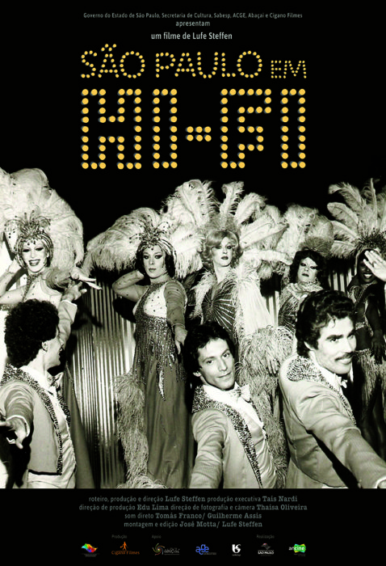

O documentário apresenta histórias das noites gays em São Paulo nas décadas de 1960, 1970 e 1980. Fazendo uma viagem no passado, os personagens mostram as histórias das dançarinas e transformistas que se apresentavam nas famosas casas noturnas que marcaram época e tudo o que elas tiveram que passar, como a imposição da ditadura e a famosa explosão da Aids.

 

[voltar para o topo](#topo)

 

 

 

 

 

 

31 de agosto, às 15h

Apresentação dos processos de VESTIRCORPONÚ = EXPLOSÃO, de Aretha Sadick e convidados.

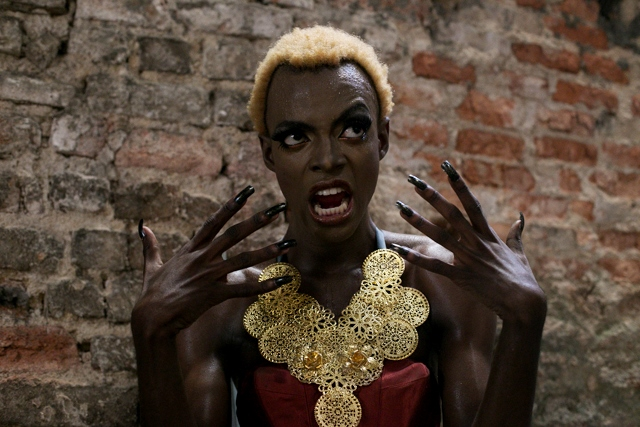

 

[voltar para o topo](#topo)

 

01 de setembro, às 17h, Conversa, Propostas para uma Pedagogia Queer

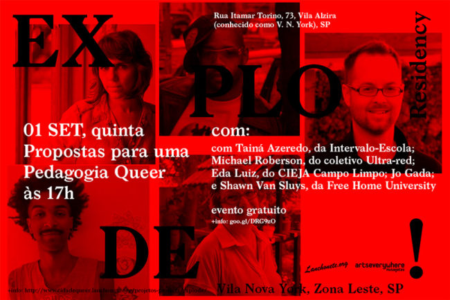

A conversa contará com a presença de Tainá Azeredo, da [Intervalo-Escola](https://www.facebook.com/plataformaintervaloescola/?fref=ts); Michael Roberson, do coletivo [Ultra-red](http://www.ultrared.org/); Eda Luiz, do [CIEJA Campo Limpo](http://blogdociejacampolimpo.blogspot.com.br/); e Shawn Van Sluys, falando sobre [Free Home University](https://www.facebook.com/freehomeuni/?fref=ts).

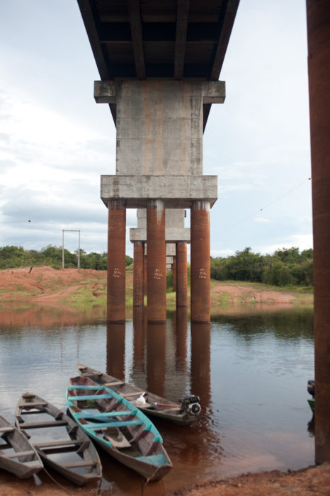 Rio Tupana e BR-319, uma das regiões de atuação da Intervalo-Escola na Amazônia

[voltar para o topo](#topo)

 

02 de setembro, 12h, Performance de encerramento, com Bruno Mendonça

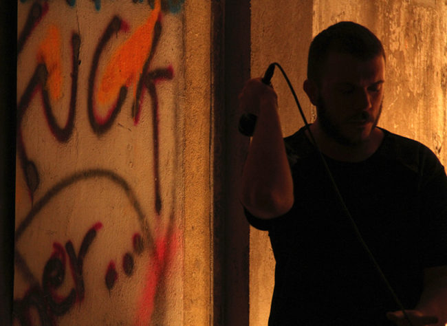

 

[voltar para o topo](#topo)

 

**_Endereço_:** [Rua Itamar Torino, 73, Vila Nova York, São Paulo, SP](https://goo.gl/maps/bX4TjiB8GYC2) 

**_Contatos_:** claudio.bueno@gmail.com e joaomls@gmail.com 11 99857 8145 11 94344 1302
