Entre os dias 23 de agosto e 2 de setembro acontecerá a [Explode! Residency](https://cidadequeer.local//projetos-projects/explode/). Conheça abaixo os artistas, performers, educadorxs, dançarinxs e agentes culturais que integrarão a residência.

Between August 23rd and September 2nd will happen the Explode! Residency will take place. See below the artists, performers, educators, dancers and culture makers who will be part of the residency.

 

_**Aretha Sadick**_

<iframe src="https://www.youtube.com/embed/4lD4QxQOOG4" width="560" height="315" frameborder="0" allowfullscreen="allowfullscreen"></iframe>

 

 

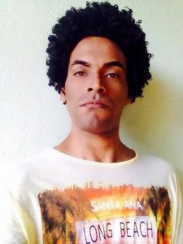_**Cadu Oliveira**_ – MBA em Gestão de Pessoas pela Anhanguera, formado em Marketing e Vendas pela Universidade Anhembi Morumbi. Com Iniciação em CNV( comunicação não violenta, com Sandra Caselato e Yuri Haasz -julho de 2015) e Justiça Restaurativa(desde maio desse ano com Mônica Mumi). Faz extensão para a Formação para Educadores: Coordenação de Grupos de Juventudes( desde de agosto desse ano com Helena Lucchino). Envolvido em ações de voluntariado desde 1996, hoje militante no coletivo Revolta Da Lâmpada e no Grupo Cume. Também fez parte da produção da 1ª Conferência \[SSEX BBOX\]/Mix Brasil. Mediou e compôs  mesas de debate sobre Diversidade Sexual e de Gênero na USP( Faculdade de Educação), Casper Líbero, Fesp e UNIP.No Festival Afreaka mediou uma mesa sobre a interseccionalidade entre negros e LGBTs com participação de Ezio Rosa do Bicha Nago e de Fauzia Mangóre do Lambda Mozi(Moçambique). Compôs as mesas de Divulgação da Crowdfunding para realização do documentário Eu\_JeanWyllys, sobre vídeo ativismo e feminismos. Ministrou oficinas nas ocupações secundaristas de Jundiaí e região usando o documentário Vozeria como mote para a discussão de gênero e sexualidade. Participou da semana da Juventude em Jundiaí com o tema #SomosTodosDiferentes, falando sobre as diferentes opressões ligadas ao gênero, etnia, sexualidades e classe. Conselheiro de Cultura LGBT da Secretaria de Cultura de Jundiaí.

**_Cadu Oliveira_** – Involved with volunteer work since 1996, today he is a militant in Revolta da Lâmpada collective and Cume Collective. Cadu also had been part of \[SSEX BBOX\] Conference. He was invited to be part of and mediate roundtable discussions in UNIP Jundiaí, FESP, Cásper Líbero-SP and USP. He has an MBA in HR in Anhanguera-SP and studied Marketing & Sales at the Universidade Anhembi Morumbi.

 

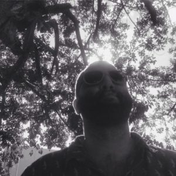

_**Claudio Bueno**_, 1983, São Paulo. É artista multimídia, professor, doutor em Artes Visuais pela ECA-USP, 2015, com a tese intitulada “Campos de Invisibilidade”. Suas práticas se desdobram a partir da experiência do corpo e seus atravessamentos pelos espaços, relações e tecnologias. Participou de exposições e residências nacionais e internacionais, como “Videobrasil em Contexto”, 2012 (Delfina Foundation/Londres e Casa Tomada/São Paulo), “Where the streets have no name”, Hessel Museum of Art/CCS Bard (Nova York); “Grau Zero”, Paço das Artes (São Paulo), entre outras. Realizou falas públicas em galerias e espaços culturais como Whitechapel Gallery (Londres), Humboldt-Universität (Berlim) e diversas universidades brasileiras. Recebeu prêmios como Menção Honrosa no Prix Ars Electronica (Linz), Rumos Arte Cibernética (São Paulo) e Transitio\_MX (Cidade do México). Atualmente integra O grupo inteiro (Carol Tonetti, Ligia Nobre, Vitor Cesar e Cláudio Bueno), com o qual participa da mostra “Playgrounds 2016”, MASP/Sesc e colabora com o artista Jorge Menna Barreto na espacialização da obra Restauro, em exibição na 32a Bienal de Artes de São Paulo; realiza o projeto Intervalo-Escola, junto com Tainá Azeredo, que pesquisa e experimenta modos de aprendizagem em artes, atualmente na Amazônia e em São Paulo; e pesquisa questões relacionadas a gênero, música e periferia através da plataforma Explode!, da qual é cocurador ao lado de João Simões.

Artist, researcher, professor, designer and coordinator of graphic and digital projects. His research explores the relationships between space, technology and the body, and their impact on the concepts of network, participation, information,architecture and invisibility. Bueno creates installations, performances, collective initiatives and texts that explore intersections among these fields. He holds a Master’s degree and a PhD from the University of São Paulo Visual Arts Department and both contemplated the aforementioned subjects. As an artist, he has been featured in many national and international exhibitions at venues such as Paço das Artes, Luciana Brito Gallery, Itaú Cultural, MIS, MARP, SESC (Brazil); La Chambre Blanche and Avatar (Canada), Centro Multimedia (Mexico); Hessel Museum of Art/CCS Bard (USA), etc. He taught at the graduate course at IED (Istituto Europeo di Design), the post-graduate course at Anhembi-Morumbi University and has delivered talks at Casa Tomada, Whitechapel Gallery (UK), HumboldtUniversity (Germany), as well as many Brazilian and international cultural institutions and universities. He has been the recipient of the following awards and grants: Videobrasil em Contexto (Brazil and UK – a partnership between: Casa Tomada, Videobrasil and the Delfina Foundation); Honourable Mention – Prix Ars Electronica (Austria); Transitio MX Award (Mexico); Rumos Arte Cibernética - Itaú Cultural (Brazil); Arte.Mov Festival (Brazil); to name a few. Nowdays, he's a member o O Grupo Inteiro (Carol Tonetti, Lígia Nobre, Vitor Cesar and Cláudio Bueno), which participated in the exhibition “Playgrounds 2016”, MASP/Sesc and colaborated with the artist Jorge Menna Barreto in the work “Restauro”, 32nd Bienal de São Paulo; in partnership with Tainá Azeredo, realizes “Intervalo-Escola” project, which researches and experiments ways of learning in the arts, in Amazonas and São Paulo; Cláudio also researches questions related to gender, music and the periphery through the Explode! Platform, which is co-curated with João Simões.

 

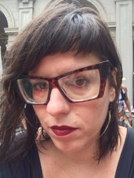

_**Daniela Mattos**_ é Artista, educadora e curadora independente. Desenvolve sua produção em artes visuais desde o início dos anos 2000 com enfoque nas práticas da performance, fotografia, videoarte e escrita de artista. Tem atuado em instituições culturais, galerias, espaços geridos por artistas e a universidade, no Brasil e em outros países como Costa Rica, Chile, Eslovênia, França, Estados Unidos, entre outros. Atualmente é Pós-Doutoranda no PPGAV-EBA/UFRJ, com pesquisa acerca das relações entre a escrita e a imagem produzidas por mulheres. Alguns de seus trabalhos e projetos encontram-se documentados em seu website: [http://www.danielamattos.art.br](http://www.danielamattos.art.br/)

_**Daniela Mattos**_ is an artist, educator and independent curator. She develops her production in visual arts since the begining of the 2000s, focused on the practice of performance, photography, videoart and artistic writing. Daniela has been working in cultural institutions, art galleries, artist-run spaces and the university, in Brazil and another countries like Costa Rica, Chile, Slovenia, France, United States, among others. Nowadays, she is a postdoctoral researcher in PPGAV-EBA/UFRJ, and her research is about the relations between writing and images produced by women. Some of her works and projects can be found on her website: [http://www.danielamattos.art.br](http://www.danielamattos.art.br)

 

_**Danna Lisboa**_ é uma artista que traz as próprias influencias da cultura e do movimento Hip Hop. Mulher Trans, professora de dança e performer, Danna expressa a sua identidade por meio da arte, direcionando o seu foco na musica e na dança. Por meio de timbres graves, rimas estilosas e beats dançantes. Em seus trabalhos, apresenta conteúdos e questões contemporâneas e socialmente engajadas sem perder o lado divertido da música para pista.

**_Danna Lisboa_** is an artist who brings her influences from the Hip Hop culture and movement. Trans woman, dance teacher and performer, Danna express her identity through the arts, focusing on music and dance, by means of lower timbres, stylish rhymes and dancing beats. In her works, Danna presents contemporary and socially engaged content and issues without losing the fun side of dance music.

 

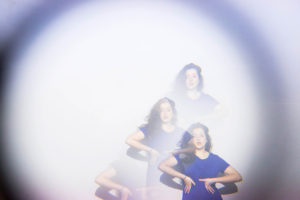

**Danila Bustamante** é videomaker, fotógrafa e produtora cultural. Criadora de pensamentos ilustres busca através da produção de imagens, formas diferentes e inusitadas para eternizar um momento. Participou com criações, colaborações, fotografias, videos, video-instalações de festivais internacionais e nacionais, como o FILE – Festival Internacional de Linguagem Eletrônica e “City One Minutes São Paulo”, The Oneminutes Foundation, Amsterdã, Holanda. Foi bolsista no “Seminário Internacional no Festival de Filme de Munique / Stipendium Für Kulturmittler / FilmFest München”, 2009 – Alemanha. Atualmente colabora com o Instituto Goethe São Paulo (SP), Mostra Live Cinema (RJ), Cineclube Socioambiental Crisantempo (SP) e MirellaBrandi x Muepetmo (SP). Criou a marca Bijoux di Buate e faz parte do projeto DIANA, sobre estudos em Waacking e a vida afora.

**Danila Bustamante** is a videomaker, photographer and cultural producer. Creator of illustrious thoughts, she seeks, through the production of images, different and unusual ways to remember a moment. Danila has participated with creations, collaborations, photos, videos, and video installations in many festivals such as FILE – International Festival of Electronic Language and “City One Minutes São Paulo,” The Oneminutes Foundation, Amsterdam, Netherlands. She received a scholarship at the “International Seminar at the Munich Film Festival / Stipendium Für Kulturmittler / FilmFest München”, 2009 – Germany. Currently collaborates with the Goethe Institute São Paulo (SP), Live Cinema Festival (RJ), Cineclube Socioambiental Crisantempo (SP) and the audiovisual artists MirellaBrandi x Muepetmo (SP). Creator of Bijoux di Buate brand and also is part of DIANA project of Waacking studies.

 

 

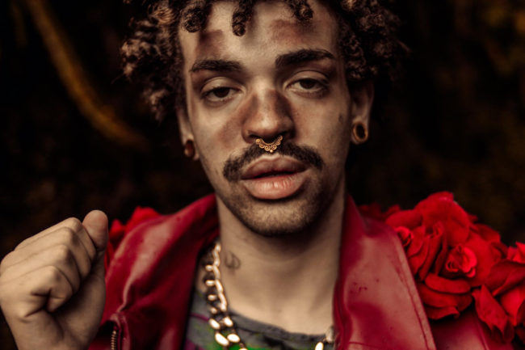

_**Ézio Rosa**_ é educador, integra o bloco afro Ilu Obá de Min e escreve o [blog Bicha Nagô](http://bichanago.tumblr.com/), no qual relata experiências de pessoas gays e negras nas periferias, frente à elitização da cultura LGBTQ. Leia seu texto "[Ser gay no RAP](http://bichanago.tumblr.com/post/98921378961/ser-bicha-no-rap)".

**_Ézio Rosa_** is an educator, a member of the afro bloco Ilú Obá de Min and writes the [blog Bicha Nagô](http://www.bichanago.tumblr.com), which relates experiences of black gay people on the periphery, up against the elitization of LGBT culture. Read his text ["Being gay on RAP"](http://bichanago.tumblr.com/post/98921378961/ser-bicha-no-rap) (only in portuguese).

 

\[caption id="attachment\_978" align="alignleft" width="200"\]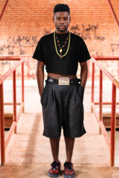 Foto: Cello Lopes\[/caption\]

_**Félix Pimenta**_, 26 anos, dançarino performer, pesquisador, professor e coreógrafo de danças urbanas. Especializado nas danças Waacking e Voguing, é membro da IHOW( Imperial House of Waacking) - Chapter Brasil, Coletivo Ritmos de Rua, Cia. Crioulos e Afronte coletivo de performance. Ministra workshops, aulas e faz júri por todo o Brasil. Performer da noite paulistana e participante de batalhas em diversos eventos.

**_Félix Pimenta_**, 26 years-old, dancer, performer, researcher, professor and urban dances choreographer. He is specialized in Waacking and Voguing and a member of IHOW (Imperial House of Waacking) - Chapter Brazil, Coletivo Ritmos de Rua, Cia. Crioulos and Afronte performance collective. Félix conducts workshops, classes and works as a judge for contests all over the country. He performs in the Sao Paulo nightlife/ parties and participates in battles in several events.

 

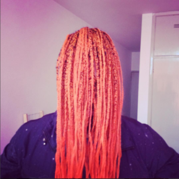

_**João Simões**_, Rio de Janeiro, 1979. É curador, produtor, designer e educador. Possui graduação em comunicação social pela ESPM-SP e pós-graduação em gestão de mídias digitais pelo Senac-SP. Com o Projeto Arrastão, atua na elaboração e execução de oficinas de empreendedorismo, inovação social e tecnologia para jovens de baixa renda. É co-curador do projeto Explode! de música, audiovisual, periferia, gênero e artes. Desenvolveu trabalhos gráficos e sonoros para artistas e instituições culturais, como Paço das Artes, Videobrasil, CCSP e LabMovel. Além disso, realiza pesquisa em comunicação, política, gênero e redes digitais. Tem sua atenção voltada a música, moda, artes visuais, dança, performance, tecnologia e culinária vegana.

**João Simões,** Rio de Janeiro, 1979. Curator, producer, designer and educator. He studied social communication in ESPM-SP and has a post-degree in digital media management in Senac-SP. With Projeto Arrastão, acts as a planner and educator of workshops about entrepreneurship, social innovation and technology to low-income young adults. He is co-curator of Explode! Project of music, audiovisual, periphery, gender and arts. João developed graphic design works and voiceovers to artists and cultural institutions as Paço das Artes, Videobrasil, CCSP and LabMovel. Furthermore, he has a research about communications, politics, gender and digital networks. Has his attention focused on music, fashion, visual arts, dance, performance, technology and vegan cuisine.

 

_**Jo Gada,**_ 25 anos, arte educadora e performer, trabalha com produções de arte, cultura e educação, e com performances em espaços públicos no Rio de Janeiro junto com o Grupo Mensageiros do Vento, através de poesia, musica, corpo, cultura popular, trazendo questões de gênero, o medo presente no cotidiano da cidade e ancestralidades.

**_Jo Gada,_** 25 years-old, art educator and performer, works with art, culture and education productions and perfomance in public spaces at Rio de Janeiro with the collective Grupo Mensageiros do Vento, using poetry, music, body and popular culture to question gender issues, fear in the daily urban life and ancestries.

 

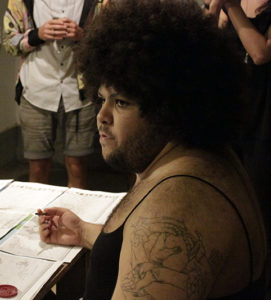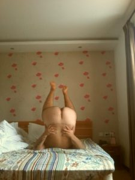

_**Jota Mombaça**_, 1991. Ensaísta e Performer. É uma bicha não binária, racializada como parda, nascida e criada no Nordeste do Brasil, que escreve, performa e faz estudos acadêmicos em torno das relações entre monstruosidade e humanidade, estudos kuir, giros descoloniais, interseccionalidade política e tensões entre ética, estética, arte e política nas produções de conhecimentos do sul-do-sul globalizado.

_**Jota Mombaça**_, 1991. Writer and performance artist. Is a non-binary bicha, racialized as brown, born and raised  in  the northeast of Brazil, who writes, performs  and  academically studies on the relations between monstrosity and  humanity, kuir studies, decolonizing turns, political intersectionality and tensions among ethics, aesthetics, art and politics in the knowledge productions of the global south-of-the-south.

 

**_Lee Ann Norman_** é escritora e produtora cultural e ama contar boas histórias sobre artes no seu dia-a-dia. É co-gerente editorial da plataforma ArtsEverywhere. Suas pesquisas acadêmicas e criativas apontam para o interesse no desenho de espaços que permitem às pessoas aprender sobre os outros e sobre si mesmas através da arte. Essencialmente, seu interesse é sobre como os outros entendem o mundo e como essas leituras podem influenciá-lo. Especificamente, ela quer entender mais sobre o papel das conversas e investigações nas atividades artísticas. Seus textos foram publicados em diversas publicações como BOMB, Studio - the Studio Museum of Harlem's magazine e Penn GSE Journal of Urban Education. Lee Ann estudou crítica de arte e escrita na Escola de Artes Visuais, em Nova York. Atualmente, ela trabalha entre Chicago e Nova York.

**_Lee Ann Norman_** is a writer and culture maker who loves to tell good stories about the arts in our everyday. She is co-managing editor of ArtsEverywhere platform. Her scholarly investigations and creative yarns highlight an interest in designing spaces that allow people to learn about each other and themselves through the arts. Broadly, she's curious about how others read the world and how their reading(s) influence everything. Specifically, she wants to understand more about the role of conversation and inquiry in creative pursuits. Her writing has appeared in a variety of publications, including BOMB, Studio, the Studio Museum of Harlem's magazine, and the Penn GSE Journal on Urban Education. Lee Ann studied art criticism and writing at the School of Visual Arts. She currently works between Chicago and New York City.

 

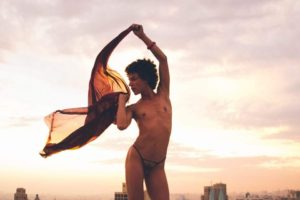

_**Mavi Veloso,**_ 1985, nascida em Pacaembu, São Paulo, Brasil vive atualmente em Bruxelas, de onde estabelece pontes entre o Brasil e Europa trabalhando transdisciplinarmente em diferentes práticas artísticas. Estudou dança, teatro, música e circo através de processos de formação formais e informais.Graduação em artes na Universidade Estadual de Londrina, Paraná, Brasil (2009). Estudos continuados em performatividade com a plataforma COMO clube, São Paulo (2011-2014). Pós Mestrado em performance no A.PASS (Advanced Performance And Scenography Studies) (2014/2016), Bruxelas / Bélgica. Entre alguns trabalhos recentes são: O curta-metragem Eu Vou Me Piratear, dirigido por Daniel Favaretto e Dudu Quintanilha, que vem sendo exibido em alguns festivais de cinema internacional e internacional como o Mix Brasil, em São Paulo, Brasil e Visions du Réel, em Nyon, Suíça; Também, o filme Cor-de-rosa, dirigida por Octávio Tavares e Francisca Oyaneder, uma produção Brasil Argentina ainda em processo; Os projetos de performance Indementária Popular\_cut & paste, Private Room (com Dudu Quintanilha, Eidlgas Xavier e Glamour Garcia), o projeto PRETA (com Alex Cassimiro, Andrez magra Ghizze, Caio, Eidglas e Teresa Moura Neves). Atualmente desenvolve "iwannamakerevolution", projeto multimedia transdisciplinar sobre deslocamentos, transitos e corpos mutantes, iniciado no pós mestre A.PASS.

Born in 1985 in Pacaembu in the state of São Paulo, Brazil currently lives in Brussels, Belgium from where she establishes bridges between Brazil and Europe working transdisciplinarily in different artistic practices. Studied dance, theatre, music and circus through varied formal and informal training processes. Has graduated in arts at the State University of Londrina, Paraná, Brazil (2009), continued studies in performativity with the COMO clube artist platform, São Paulo (2011-2014), did a post master in performance at A.PASS (Advanced Performance And Scenography Studies) (20142016), Brussels/Belgium. Among some recent works are: The short film The Get Up, directed by Daniel Favaretto and Dudu Quintanilha, touring to some film festivals such as Mix Brasil in São Paulo, Brazil and Vision du Réel in Nyon, Switzerland; Also the feature film The Pink Color, directed by Octávio Tavares and Francisca Oyaneder, a Brazil Argentina production still in process; The performance projects Indumentária Popular\_cut & paste, Private Room started with Dudu Quintanilha, Eidlgas Xavier and Glamour Garcia, the project PRETA with Alex Cassimiro, Andrez Lean Ghizze, Caio, Eidglas and Teresa Moura Neves presented in diverse places such as Verbo Performance Art Festival São Paulo and Centro Cultural São Paulo. Is currently developing I Wanna Make Revolution, a multimedia project on displacements, mutant and in-transit bodies, started at the post master at A.PASS.

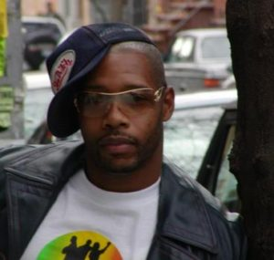

_**Michael Roberson**_ é um profissional de saúde pública, defensor, ativista e liderança dentro da comunidade LGBTQ,  assim como professor-adjunto da The New School University/Lang College, em Nova York. Comprometido com as discrepâncias de saúde de homens negros e homens negros dentro das House/ball communities, Michael criou a The Federation of Ballroom Houses (Federação de Ballroom Houses), co-criou único grupo estadunidense de pesquisa sobre gays negros, além do The National Black Gay Men's Advocacy Group (Grupo de Defesa Nacional de Homens Gays Negros), e o Nationally Diffused CDC Behavioral Change HIV Prevention Intervention “ Many Men, Many Voices". Foi também diretor executivo de uma das maiores organizações de base da conunidade gay negra e atualmente faz consultoria para diversas outras organizações comunitárias focadas em pesquisa clínica/biomédica sobre HIV. Desenvolve estratégias de mobilização e combate as disparidades desproporcionais nas políticas de saúde que impactam as populações gays negras e lgbt negras/latinas dentro das ball communities. Michael possui Mestrado em Divindade pelo Union Theological Seminary e recentemente concluiu seu Mestrado em Teologia Sagrada pela mesma instituição. Somando a todas essas papéis como ativista e liderança LGBTQ, Michael é um procurado palestrante nacional e internacional; gerencia o Vogue Evolution, um grupo de dança estadunidense que busca engajamento sobre justiça social e prevenção ao HIV através do Vogue. É pai de muitos homens e mulheres dentro da House/ball community, assim como co-instrutor do curso de história da House/ball community na New School University em Nova York. Sua atual pesquisa de doutorado relaciona de forma interdisciplinar ética teológica social/sexual e história afro-americana. Ele é membro do coletivo de arte sonora internacional Ultra Red e foi Scholar in Residence no Center for Race Religion and Economic Democracy (CRRED) da Union Theological Seminary no ano acadêmico de 2014-2015. Continua a ocupar essa posição fora da insitituição sob a direção de Charlene Sinclair, doutoranda, líder comunitária, pesquisadora, criadora a fundadora do CRRED.

_**Michael Roberson**_ is a public health practitioner, advocate, activist and leader within the LGBTQ community, as well as an Adjunct Professor at The New School University/Lang College, NYC. With a focused commitment on the health disparities of Black gay men and Black gay men within the House/ball community Michael created The Federation of Ballroom Houses, co -created the nation's only Black Gay research Group, The National Black Gay Men's Advocacy Group, and the Nationally Diffused CDC Behavioral Change HIV Prevention Intervention “ Many Men, Many Voices.” Michael was also the Executive Director of one of the largest black gay community based organizations, and currently is a consultant working with several national community based organizations focused on national HIV Clinical Trial/Bio-medical, and Home grown evidence based interventions, as well as national community capacity building assistance and mobilization strategies designed to combat the disproportionate health disparities impacting both the black gay and black/Latino lgbt house ball communities. Michael graduated with his MDIV from Union Theological Seminary, and currently completed his STM (Masters of Sacred Theology) at Union as well. In addition to his many roles as activist and leader Michael is a sought after lecturer nationally and internationally, manages Vogue Evolution, a national dance crew engaging in social justice and HIV Prevention through vogue. Above all Michael is a father to many men and women within the House/ball community, as well as, Co-instructs a course on the history of the house/ball community at the New School University in New York City. Michael is looking to PHD work with a inter-disciplinary focus on Theological Social/Sexual Ethics and African-American History. He is a member of The International Sound Art Collective Ultra Red as well as the Scholar in Residence for The Center for Race Religion and Economic Democracy (CRRED) at Union Theological Seminary for the Academic year of 2014-2015, and continues to occupy this post outside of Union under the auspices of Charlene Sinclair, PhD Candidate, community organizer, scholar, creator and founder of CRRED.

\[caption id="attachment\_905" align="alignleft" width="300"\]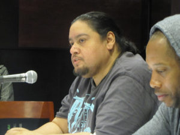 Michael Roberson and Arbert Santana Evisu: Vogue'ology Encuentro that took place on May 8, 2010 in the Orozco Room at The New School in New York City.\[/caption\]

\[caption id="attachment\_906" align="alignnone" width="301"\]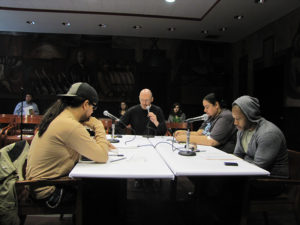 Michael Roberson, Arbert Santana Evisu, Vivika Sage Riviera, Robert Sember: Vogue'ology listening session\[/caption\]

 

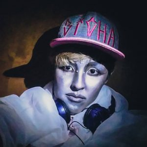

**_Nube Abe_****_._** Bicha, sapatão, mina, boy, ora tudo ora nada. Vive na Zona Leste, e desenvolve trabalhos e práticas que mesclam fotografia, audiovisual, música, performance, montação, kuir, transfeminismo, pós-pornografia, xamanismo, deriva, butô, cotidiano, cidade, natureza, dissidências, corpo, dança, relações, afetos. 

**_Nube Abe._** Gay, lesbian, girl, boy, sometimes everything, at other times nothing. Living in the east zone of São Paulo, she develops works and practices that mix photography, audiovisual, music, performance, drag, kuir, transfeminism, post-porn, shamanism, adrift, buto, quotidian, city, nature,  schisms, bodies, dance, relations, affections.

 

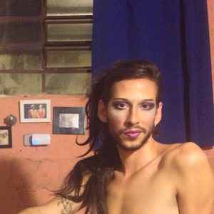

**_Paulo Scharlach_**, 1987, Cotia, é artista multimídia, educador e produtor. Bacharel em Artes Visuais pelo Instituto de Artes – UNESP/SP com o trabalho de conclusão de curso sobre as narrativas fragmentadas, a formação de redes de ideias e a experiência nos múltiplos processos de tradução. Participou de mostras coletivas e produziu eventos culturais autônomos conjuntamente a outros coletivos no Brasil e no exterior, sendo: KUIR BOGOTÁ , vídeo VÍTIMA(CO-2015); na casa de Cultura de Teresina, Atalho para bem ali (PI- 2014); Museu Murillo La Greca, Atalho para bem ali (PE-2014); Instalação Visual “Almanaque da Juventude de Ouro”(SP-2014) no Epicentro Cultural; Residencia artística e mostra em El Parche Artist Residency (CO-2013/2014); Intervenções urbanas pertencentes ao mesmo projeto “Almanaque da Juventude de Ouro” em Bogotá (CO-2014), La Paz (BO-2013), Tilcara(AR-2013), Cooperativa de Vivienda de San Telmo, Buenos Aires (AR-2013), Obra em video, Mostra SHORTS CURTS Teatro do Morro do Querosene (SP-2012). Durante 3 anos manteve uma plataforma independente ao lado de um de seus companheiros de trabalho Adler Murada, EDITORA ESPERTEZA. Participando das seguintes feiras, Tijuana #7(2012), Tijuana#9 (2014), Feira Plana (2014), Feira de publicações do SESC Pompéia (2014), dentre outras.

**_Paulo Scharlach,_** 1987, Cotia, is a multimedia artist, educator and producer. He studied visual arts in Instituto de Artes - UNESP/SP and his coursework was about fragmented narratives, the formation of networks of ideas and the experience of multiple translation processes. Paulo has been participating in collective exhibits and has been producing independent cultural events with other collectives in Brazil and abroad, like: KUIR BOGOTÁ, video "VÍTIMA" (2015); in Casa da Cultura de Teresina, "Atalho para bem ali" (2014); in Museu Murillo La Greca, Atalho para bem ali (2014); in Epicentro Cultural, visual installation "Almanaque da juventude de ouro" (2014); in El Parche Artist Residency, artistic residency and exhibit (2013-2014); urban interventions, "Almanaque da juventude de ouro" in Bogotá (2014), La Paz (2013), Tilcara (2013) and Cooperativa Vivienda de San Telmo, Buenos Aires (2013); MOSTRA SHORT CURTS, Teatro Morro do Querosene, video (2012). For 3 years he maintained an independent platform alongside one of his workmates Adler Murada, Editora Esperteza. He participated of some independent art publishing fairs, like Tijuana #7 (2012), Tijuana #9 (2014), Feira Plana (2014), Feira de Publicações do Sesc Pompeia (2014) etc.

 

_**The Legendary Pony Zion Garcon**_ – Nascido e criado nas agitadas ruas do Harlem, Devon "Pony Zion" Webster tem dedicado sua vida à dança desde seus 10 anos. Coreografou diversos artistas como a cantora de R&B Ashanti, a cantora Lil Mo, o músico Shaggy, o artista de hip hop Big Pun (1971-2000), a estrela do RAP Remy Martin, a artista pop premiada pelo Grammy Fergie, o rapper Big Sean, e também uma das cantoras mais bem-sucedidas de todos os tempos, Mariah Carey… Sim, seu sucesso não para aqui. Pony também dominou a arte do Vogue, um estilo de dança que tira proveito e mostra os contornos do corpo através da exacerbação da flexibilidade e da elegância. Hoje, já como uma lenda do Vogue, é um dos fundadores do Vogue Evolution – grupo que participou da quarta temporada do programa da MTV America's Best Dance Crew –, primeiro grupo de dança negro/ latino abertamente gay e transgênero. Pony está atualmente viajando por todo o mundo performando, dirigindo artistas, fazendo direção artística de "bailes de celebridades" e ensinando Vogue para aqueles que tem interesse pela Ballroom culture.

_**O Lendário Pony Zion Garcon**_ – Born and raised in the busy streets of Harlem, Devon “Pony Zion” Webster has dedicated his life to dance since the tender age of 10. Pony has choreographed for multi platinum R&B recording artist Ashanti,Lil Mo,Shaggy, the late hip hop star Big Pun, rap star Remy Martin,  Grammy winning Pop Star Fergie, rap artist Big Sean and even the biggest selling female recording artist of all time, Mariah Carey… Yet his success doesn’t stop there. Pony has also mastered the Art of “Vogue”. A form of dance that capitalizes and displays the contours of the body through enhanced flexibility and finesse. Now a Vogue Legend, Pony is the founder of Vogue Evolution from MTV’s "America's Best Dance Crew". The first black and Latino openly gay/transgender dance crew. Pony is now traveling all around the world Performance coaching artist, creative  directing "Celebrity balls" and teaching Vogue to those that embrace Ballroom culture.

 

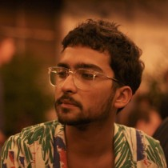

**_Raphael Daibert,_** 1988, nasceu em Minas Gerais, cresceu no Rio e vive em São Paulo. Graduou-se em Relações Internacionais na PUC-SP e se especializou Habitação e Cidades, na Escola da Cidade. Raphael é pesquisador, produtor cultural e ativista pelos direitos humanos e pelo direito à cidade. Já trabalhou com diferentes formas de engajamento comunitário, principalmente relacionado a questões LGBT, de moradia e migrações, especificamente em São Paulo, onde no começo de 2015 realizou uma pesquisa com refugiados e migrantes que estavam integrando o movimento de moradia do centro.  É um dos membros fundadores de Lanchonete.org, pelo qual é coordenador de programação do projeto Zona da Mata, um laboratório de experimentação no quintal do Goethe-Institut São Paulo que envolve arte e permacultura, além de integrante do programa de investigação curatorial coletiva Cidade Queer. Em 2015-2016 integra o experimento pedagógico-artístico Free Home University na cidade de Lecce, Itália.

**_Raphael Daibert,_** 1988, born in Minas Gerais, raised in Rio and based in São Paulo, Brazil. Graduated in International Relations at Pontifical Catholic University of São Paulo, he has done a specialization in Housing and Urbanism at Escola da Cidade. Raphael is a human rights and right to the city activist, community organizer, researcher and cultural producer. He has worked with different forms of activism related to the LGBT community, migration and the housing movement, specifically related to the center of São Paulo. Founding member of the Lanchonete.org project in São Paulo where in 2015 he did a research on refugees and migrants that were integrating the housing movement in the center of the city. Through Lanchonete.org, Raphael is the Program Coordinator of Zona da Mata, a permanent environment laboratory at Goethe-Institut São Paulo’s backyard involving art and permaculture and is also part of Musagetes' Queer City site-specific program in São Paulo. In 2015-2016 he has been part of the artistic pedagogical experiment Free Home University in Lecce, Italy.

 

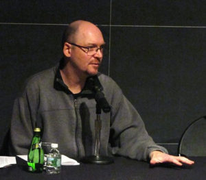

_**Robert Sember**_ trabalha na intersecção entre arte e saúde pública. Ele é membro do coletivo internacional de arte sonora Ultra Red que ajudou a fundar o Arbert Santana Ballroom Archive and Oral History Project – uma iniciativa feita por e para os membros da comunidade LGBT afro-americana e latina de Nova York. Sua pesquisa etnográfica nos EUA e na África do Sul está focada nos órgãos estatais e não governamentais com atuações relacionadas ao abuso de substâncias psicoativas, saúde mental e pessoas em situação de rua com ênfase em prevenção, teste e tratamento de HIV/AIDS. Ele é associado senior do Center for Social Innovation onde ele lidera iniciativas relativas ao impacto da Lei de Proteção e Cuidado ao Paciente dos EUA sobre a recuperação de dependentes químicos e de saúde mental. Robert é professor-assistente de Artes Intesdisciplinares na New School’s Eugene Lang College e na faculdade do Summer Institute on Sexuality, Culture, and Society da University of Amsterdam’s Graduate School of Social Sciences.

_**Robert Sember**_ works at the intersection of art and public health. He is a member of the international sound-art collective, Ultra-red, which helped establish the Arbert Santana Ballroom Archive and Oral History Project, an initiative by and for members of the African-American and Latino/a Lesbian, Gay, Bisexual and Transgender community in New York City.  His ethnographic research in the U.S. and South Africa has focused on governmental and non-governmental substance abuse, mental health, and homelessness service sectors with an emphasis on HIV/AIDS prevention, testing, and treatment access.  He is a Senior Associate with the Center for Social Innovation where he leads initiatives concerning the impact of the Affordable Care Act on addiction and mental health recovery.  Robert is an Assistant Professor of Interdisciplinary Arts at The New School’s Eugene Lang College and is on the faculty of the Summer Institute on Sexuality, Culture, and Society at the University of Amsterdam’s Graduate School of Social Sciences.

 

_**Shawn Van Sluys**_ é diretor executivo do Musagetes, fundação filantrópica que experimenta em pequenas cidades canadenses e europeias formas de conectar essas comunidades, de forma mais intensa, com as artes e a criatividade. A missão da fundação é tornar mais significativo o papel das artes na vida das pessoas, em suas comunidades e na sociedade. Ele se uniu ao Musagetes como seu primeiro diretor executivo em janeiro de 2009. Antes disso, ele foi o primeiro diretor executivo da Organização de Diretores de Museus de Arte Canadenses, uma organização de serviços de arte que representa 85 entidades. Shawn estudou história da arte na Universidade de Lethbridge. Ele também é vice-presidente do Guelph Jazz Festival e da Casa de Cultura Ammirato em Lecce, Itália. Como membro do time executivo do Instituto Internacional de Estudos Críticos em Improvisação (IICSI, na sigla em inglês) da Universidade de Guelph, lidera o grupo de trabalho que tem sua prática baseada em pesquisa.

**_Shawn Van Sluys_** is the Executive Director of Musagetes, a philanthropic foundation that experiments in small Canadian and European cities with ways to connect communities more deeply with the arts and creativity. The foundation’s mandate is to make the arts more central and meaningful in people’s lives, in their communities and societies. He joined Musagetes as its first Executive Director in January 2009. Prior to that, he was the first Executive Director of the Canadian Art Museum Directors’ Organization, a national arts-service organization that represents 85 museum directors. Shawn studied art history at the University of Lethbridge. He is the Vice-President of the Guelph Jazz Festival and of the Ammirato Culture House in Lecce, Italy. As a member of the Executive Team of the International Institute for Critical Studies in Improvisation (IICSI) at the University of Guelph, he leads the Practice-Based Research working group.

 

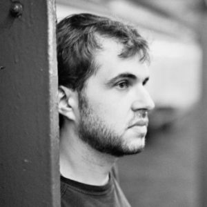

**_Thiago Carrapatoso_** é jornalista, especialista em Comunicação, Arte e Tecnologia e mestre pelo Center for Curatorial Studies (CCS) da Bard College (NY). Ele é um dos idealizadores do Movimento BaixoCentro em São Paulo, que reivindica o uso da ruas pela sociedade civil. Faz parte da REPEP (Rede Paulista de Educação Patrimonial) que busca criar uma metodologia para usar a educação patrimonial contra a gentrificação.

_**Thiago Carrapatoso**_ is a journalist, specialist in Communication, Arts, and Technology and holds a MA from the Center for Curatorial Studies (CCS) at Bard College (NY). He is a collaborator of the BaixoCentro Movement in São Paulo, Brazil, which tries to reclaim the streets from a civil society perspective. Thiago is a member of the REPEP group, helping create a methodology to use heritage education against gentrification.

 

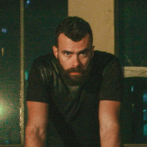

_**Tiago Guiness**_ atua como dj desde 2004. Tendo começado em Fortaleza, atualmente promove a Tenda, festa que acontece mensalmente no centro da cidade de São Paulo. Participa do grupo Diana onde organiza workshops de dança voltados à prática do estilo waacking. É também formado em arquitetura e faz parte do Estúdio Risco, no qual desenvolve trabalhos de expografia, cenografia, design de objeto, entre outros.

**_Tiago Guiness_** works as dj since 2004. He began this activity in Fortaleza (Ceará), but today he promotes Tenda, a monthly party that happens in São Paulo downtown. Tiago participates of Diana collective that organizes dance workshops focused on the practice of Waacking style. He's also graduated in architecture and is a partner of Estúdio Risco, where he develops works of expography, scenography, product design, etc.

 

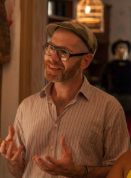_**Todd Lester**_ Trabalhou com liderança, _advocacy_ e planejamento estratégico nas organizações Global Arts Corps, Reporters sans frontiers e Astraea Lesbian Justice Foundation.  Fundou freeDimensional, uma rede que apoia artistas em perigo provendo espaços seguros pela participação em residências artísticas pelo mundo. Todd é Colaborador Senior do World Policy Institute onde dirige o Arts-Policy Nexus; é co-curador para Arts & Society Team of Cities for People no Canada; e participa como membro de diversos conselhos em organizações de artes e direitos humanos na Índia, México, Brasil e Estados Unidos.  artist.roundtable (A.RT) é uma metodologia colaborativa que ele vem fazendo em conjunto com um grupo de artistas e não artistas.

_**Todd Lester**_ He has worked in leadership, advocacy, and strategic planning roles at Global Arts Corps, Reporters sans frontiers, and Astraea Lesbian Justice Foundation.  He founded freeDimensional, a network that helps artists in danger by providing safe haven in participating artist residencies.  Todd is a Senior Fellow at the World Policy Institute where he directs the Arts-Policy Nexus; a co-curator for the Arts & Society Team of Cities for People in Canada; and serves as a board member for arts, rights and literary organizations in India, Mexico, Brazil, and the US.  artist.roundtable (A.RT) is a collaborative methodology that he is co-making with a broad group of artists and non-artists.

 

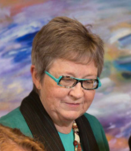

_**Yeti Agnew**_ é fundadora e diretora da Fundação Musagetes. Estudou Direito na Universidade de Toronto, Química Aplicada na Universidade de Waterloo e tem grande interesse nas artes. Sua prática jurídica é especialmente focada em ajudar pessoas, em especial artistas e colecionadores, com planejamento estatal. É casada com um artista e aproveitam bem a família com seus netos. Já teve um alto cargo político na Universidade de Waterloo e foi curadora do Royal Ontario Museum. Foi a diretora de A Space, um espaço alternativo de destaque no Canadá e diretora do Canadian Gay and Lesbian Archives no qual estão as melhores coleções de materiais de comunidades LGBT do Canadá. É a co-autora de _The Art World: Law Business and Practice in Canada_ e escreveu _Legaleasy: a step-by-step legal guide to collecting for Canadian art galleries and museums_ além de um grande número de artigos. Está muito grata por ter sido chamada a vir a São Paulo em nome de Musagetes para aprender com os outros participantes.

_**Yeti Agnew**_ is a founder and director of the Musagetes Foundation. She has a background in law (J.D. University of Toronto) and applied chemistry (B.Sc. University of Waterloo) and a strong interest in the arts. Her law practice is increasingly focused on helping people, especially artists and collectors, with estate planning. She is married to an artist and they now enjoy an extended family including small grandchildren. Yeti previously served as a Governor of the University of Waterloo and a Trustee of the Royal Ontario Museum. She has also been a director of A Space, a leading alternative art space in Canada and a director of the Canadian Gay and Lesbian Archives which has Canada’s best collections of materials from its LGBTQ communities. She has co-authored _The Art World: Law Business and Practice in Canada_ and written _Legaleasy: a step-by-step legal guide to collecting for Canadian art galleries and museums_ and a number of articles. She is thrilled to have been asked to come to Sao Paolo on behalf of Musagetes to learn from the inaugural participants.
