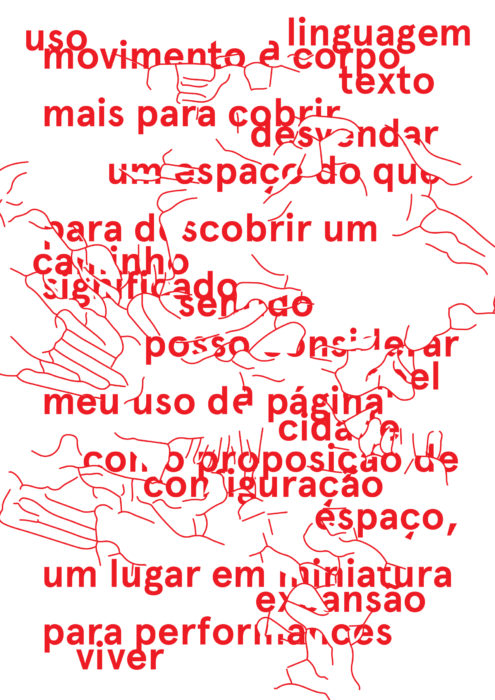

O [cartaz](https://cidadequeer.local//wp-content/uploads/2016/10/cartaz_ATAQUE_Freud.jpg) acima foi produzido a partir das frases do Freud sobre o conceito de "uncanny", estranho familiar, e utilizando, como base, as palavras análogas a queer, levantadas e discutidas durante os encontros do laboratório gráfico desviante.

 

### palavras análogas

### estranho, divergente, disruptor, imigrante, diferente, invertido, esquisito, perturbador, irreconhecível, menor, cuír, ativista, libertino, marginal, apartado, inoportuno, torto, desavergonhado, alheio, meliante, degenerado, inquietante, impertinente, anormal, esquivo, excêntrico, ermo, singular, assaltante, desviante, imigrante, diferente, invertido, esquisito, irreconhecível, anômalo, anormal, atípico, bizarro, defeituoso, deformado, desviado, duvidoso, errado, esdrúxulo, estapafúrdio, estrangeiro, estropiado, excêntrico, excepcional, exótico, extraordinário, extravagante, grosseiro, imperfeito, inabitual, incomum, indecente, infrequente, intruso, irregular, mal-acabado, oblíquo, refugiado, sem-vergonha, tosco, traiçoeiro, transviado, vagabundo

   

Cartaz realizado a partir de frase de Vito Acconci com interferência de linhas retiradas do mapa de São Paulo vetorizado.
