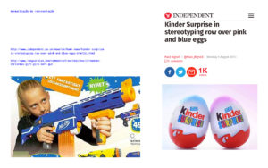
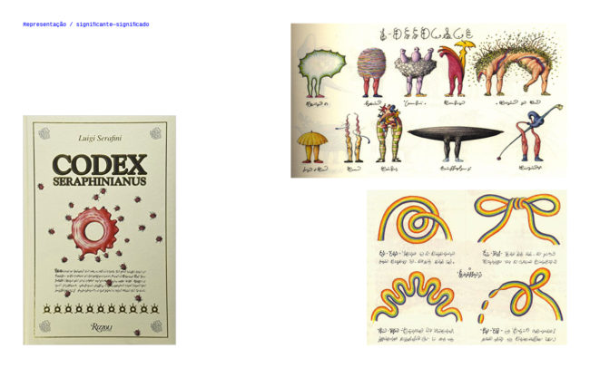

No primeiro encontro do Laboratório problematizamos a questão da normatividade e padrões de representação predeterminados. Tomando como ponto de partida alguns exemplos, como uso de cores para diferenciar sexo e tipografias pré-estabelecidas em sinalização urbana e softwares, cada integrante foi trzendo um pouco de sua experiência. Seria possível fugir da normatividade sem impor ou estabelecer uma nova norma? Talvez o único meio a partir do qual pode representar sem se basear em pré-definições seria a própria voz. A escrita com próprio punho. A autorepresentação.

A partir do conhecimento de cada um, cada background, foram sendo construídos nexos de relações sobre os temas abordados. Durante o encontro, realizamos buscas e pesquisas no computador que impulsionavam a discussão. Uma questão basal que tomou foco do encontro foi o termo _queer_. Qual significado essa palavra tem em nosso âmbito? Ficou muito claro que no inglês o termo tem uma etimologia e história clara, ele é carregado de sentidos vários. Ao importarmos "queer" (cuja raiz etimológica não nos remete a nenhuma relação) vinculamos apenas ao sentido da teoria queer, relacionando à temática de gênero e sexo. Quando pensamos o termo "queerness" do programa Cidade Queer é muito claro que não é apenas de gênero que estamos tratando, mas de um viés includente na cidade em oposição à normatividade. Temos então um problema de tradução e comunicação. Como comunicar esse _queer_ com sentido maior? Seria preciso traduzir?

 

Nessa primeira experiência juntos foi possível criar um arcabouço material a partir das discussões que foi sendo salvo no Pinterest: [pinterest.com/jliaayerbe/laboratório-gráfico-queer/](https://br.pinterest.com/jliaayerbe/laborat%C3%B3rio-gr%C3%A1fico-queer/). A ideia é que no decorrer do programa essa seja uma ferramenta de uso comunitário aberto.  

