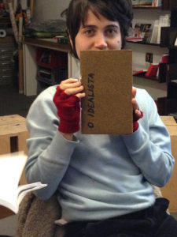
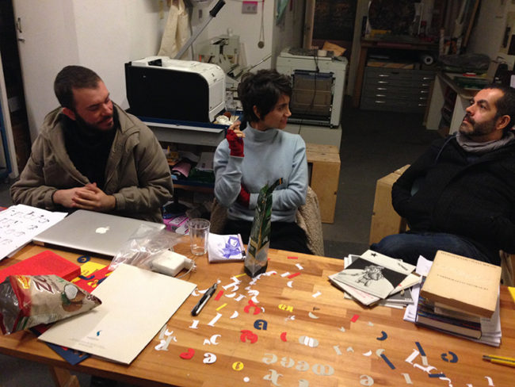
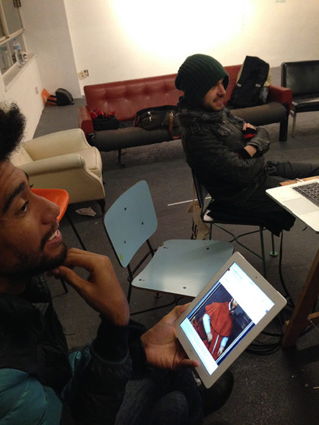
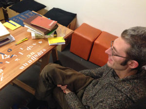

No quarto encontro levantamos a questão da normatividade nas publicações. Para além do problema das fronteiras das línguas e traduções, é possível superar a dicotomia forma X conteúdo? Projeto X processo? Como desnormatizar as operações e decisões editoriais e de design gráfico? Como desviar dos estabelecidos cânones? Cada integrante levou exemplos de publicações que de alguma forma abordam as margens e interceções entre conteúdo e forma. Pensar a estrutura de um livro em projeto editorial é tratar da forma do projeto. A forma não é apenas vinculada ao design mas também a escolhas e decisões editoriais. O design por vezes traz um excesso que confunde ao invés de ressaltar e trabalhar no mesmo sentido do conteúdo. No caso de uma publicação que questione os cânones tanto das normas da língua, quanto editoriais e de desenho gráfico, como orquestrar o projeto para além dessa dicotomia forma X conteúdo? É possível superar essa forma binária de entendimento de um projeto?

Além dessas questões, o problema da normatividade na cidade foi  levantado por Thiago Carrapatoso, que propôs levar a problemática discutida no grupo sobre língua para a vivência na cidade para pensarmos dentro do projeto Cidade Queer. Como repensar a sinalização das placas de ruas ou uso do espaço público? Propor uma nova sinalização para enfatizar o uso público por exemplo é cuirificar um pouco a cidade.

 

