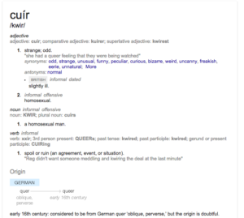
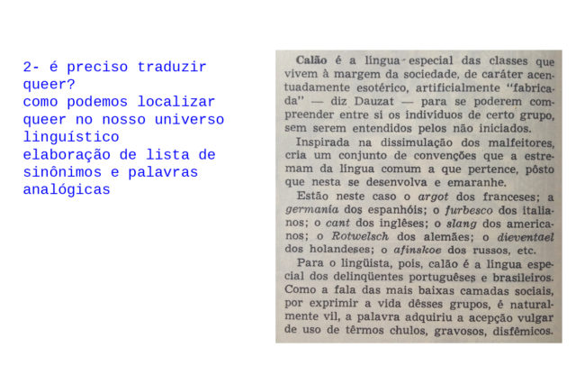

O segundo encontro se inicia com a retomada da questão da tradução do termo _queer_ e o problema das línguas latinas referente ao gênero.

Abordar _queer_ para além da questão de gênero e sexualidade é trazer de volta suas raízes etimológicas/históricas? Tudo o que não se encontra em definitivo, categorizado, catalogado, é _queer_? O artista-ornitorrinco. O ciborgue, awkward, unheimlich (o estranho familiar, inquietante, ameaçador). Mais interessante talvez do que a tradução do termo seria fazer uma lista de palavras análogas para dar conta de _queer_ enquanto conceito que queremos abordar no Laboratório e no projeto Cidade Queer.

> "Podemos reunir todas aquelas propriedades de pessoas, coisas, impressões sensórias, experiências e situações que despertam em nós o sentimento de estranheza, e inferir, então, a natureza desconhecida do estranho a partir de tudo o que esses exemplos têm em comum"

 

### palavras análogas

### estranho, divergente, disruptor, imigrante, diferente, invertido, esquisito, perturbador, irreconhecível, menor, cuír, ativista, libertino, marginal, apartado, inoportuno, torto, desavergonhado, alheio, meliante, degenerado, inquietante, impertinente, anormal, esquivo, excêntrico, ermo, singular, assaltante, desviante, imigrante, diferente, invertido, esquisito, irreconhecível, anômalo, anormal, atípico, bizarro, defeituoso, deformado, desviado, duvidoso, errado, esdrúxulo, estapafúrdio, estrangeiro, estropiado, excêntrico, excepcional, exótico, extraordinário, extravagante, grosseiro, imperfeito, inabitual, incomum, indecente, infrequente, intruso, irregular, mal-acabado, oblíquo, refugiado, sem-vergonha, tosco, traiçoeiro, transviado, vagabundo

 

A língua produz um mundo. A linguagem, a língua falada, se transforma o tempo todo para dar conta das transformações sociais, bem como tais transformações afetam nossa língua. Pajubá foi um exemplo levantado, durante o encontro, de linguagem que foi se transformando e se imbricando em diferentes meios sociais, uma língua de resistência que atravessou algumas fronteiras que agora "está na novela".

A linguagem escrita por sua vez é dura e estática, não dá conta da transitoriedade, de não definições. Ao tentarmos a solução do uso do X no lugar do artigo onde existe a flexão de gênero das línguas latinas acabamos imponto uma não fala, uma espécie de bloqueio vocal. A consoante não permite fala e o que transforma a linguagem é a fala em exercício. E se substituirmos por uma outra vogal?
