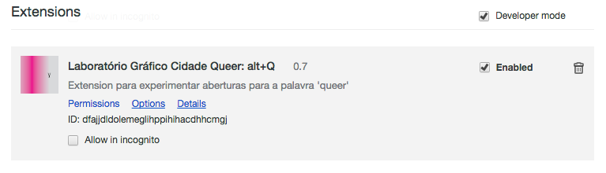
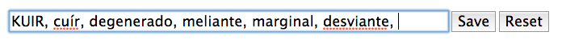
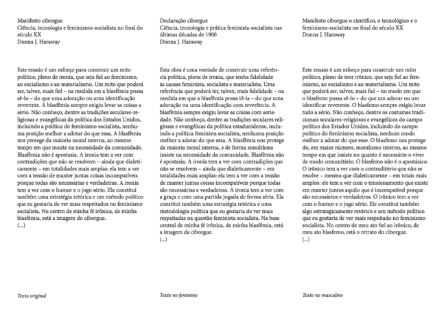
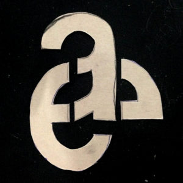
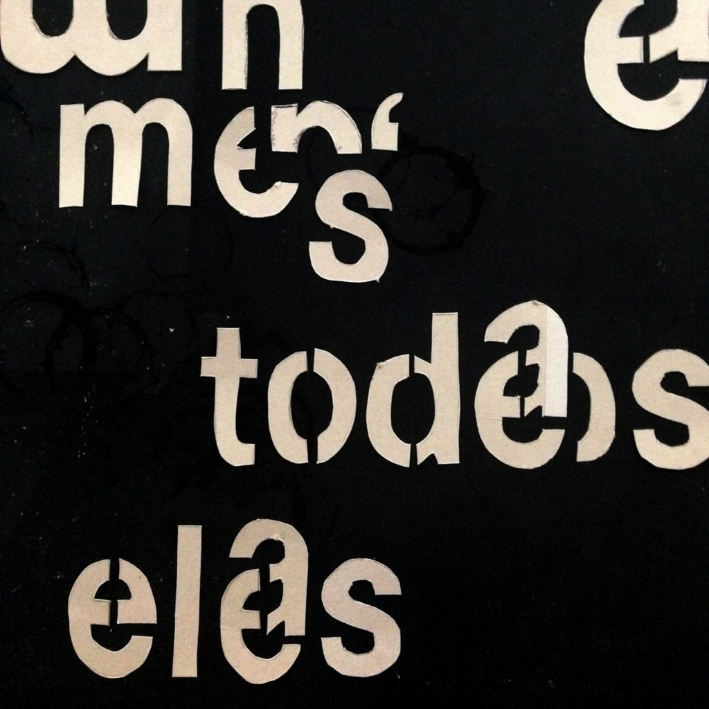
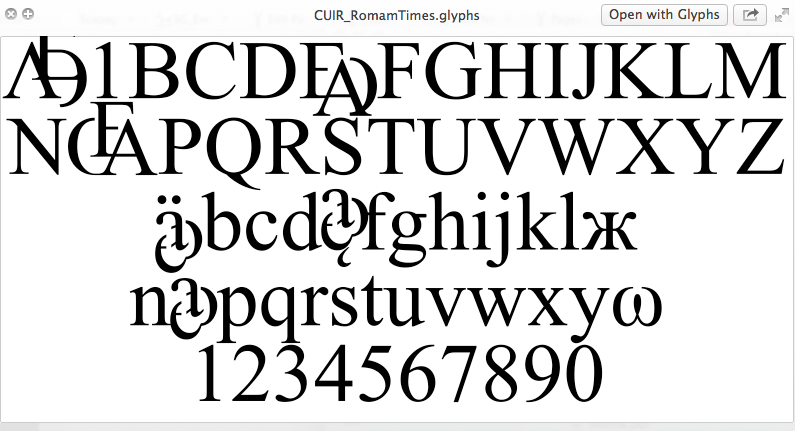

No terceiro encontro o incômodo com a tradução ou não-tradução do termo _queer_ acabou sendo amenizado com a solução de palavras análogas que podem percorrer um texto. Para substituição da palavra "queer" pelas análogas/sinônimos, Thiago Hersan, o garoto de programação do grupo, desenvolveu um [plugin](https://chrome.google.com/webstore/detail/laborat%C3%B3rio-gr%C3%A1fico-cidad/dfajjdldolemeglihppihihacdhhcmgj) para o browser Google Chrome onde é possível inserir palavras quaisquer no box de opções e em seguida automaticamente as palavras "queer" que aparecerem nas páginas do browser serão substituídas pelas novas escolhas de palavras vizinhas ou análogas. A extensão sorteia uma palavra diferente toda vez que o browser encontra a palavra "queer". Para ver e modificar a lista de palavras é só clicar em "options", clicando no ícone que fica no canto superior direito (ver foto).

Para instalar é só clicar no link: [https://chrome.google.com/webstore/detail/laborat%C3%B3rio-gr%C3%A1fico-cidad/dfajjdldolemeglihppihihacdhhcmgj](https://chrome.google.com/webstore/detail/laborat%C3%B3rio-gr%C3%A1fico-cidad/dfajjdldolemeglihppihihacdhhcmgj).

 

Outro exercício realizado foi em relação a questão do gênero em nossa língua. Fabio Morais partiu da tradução do primeiro parágrafo do Manifesto do Ciborgue da Donna Haraway para colocar o texto apenas no masculino e outra versão apenas no feminino, lado a lado. Seria possível uma versão neutra? 

 

A solução de uma nova vogal para a escrita cuír latina está sendo estudada por Laura Daviña que desenhou alguns tipos e criou possibilidades de substituição na tipografia Times. Cuirificando a fonte para criar a Cuir Roman Times. A proposta do laboratório acabou tomando um caminho de reforma da língua e não a estética. O gráfico tentará dar conta da representação/tradução do não-normativo.

 

