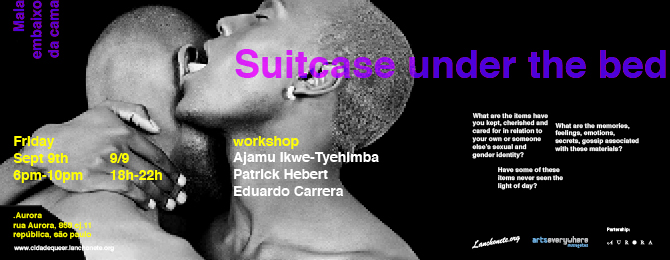

Como parte de uma série de eventos públicos com a presença de convidadxs internacionais e locais do [Cidade queer](http://cidadequeer.lanchonete.org/) ([Lanchonete.org](http://lanchonete.org/) + [Musagetes](http://musagetes.ca/)), dia **9 de setembro**, **às 18h** em parceria com .Aurora temos o prazer de convidá-lxs ao workshop **“Mala embaixo da cama”**, proposto pelos artistas Ajamu Ikwe-Tyehimba, Patrick Hebert e Eduardo Carrera.

 

**Mala embaixo da cama**

Quais são os itens que você guarda, estima e se importa relacionados à sua própria identidade sexual e de gênero ou à de outra pessoa? Alguns desses itens nunca chegaram a ver a luz do dia? Quais são as memórias, sentimentos, emoções, segredos e fofocas associados a esses materiais?

Essa brincadeira única de caráter íntimo e informal irá incentivar participantes a compartilhar e dar voz a seus arquivos pessoais. Sinta-se à vontade para trazer efemeridades como fotografias, cartas de amor, objetos de fetiche, sex toys, livros, músicas, flyers e pôsteres de eventos que você participou, peças de roupa das pessoas que você ama, revistas etc.

O que pedimos é que você revire suas caixas e álbuns pessoais e venha compartilhar com outras pessoas a história que você viveu, de maneira estimulante, empolgante e atípica.

Para informações sobre todas nossas atividades, acesse: [cidadequeer.lanchonete.org](http://cidadequeer.lanchonete.org/)

Evento no facebook: [www.facebook.com/events/1236011423110336/](https://www.facebook.com/events/1236011423110336/ "facebook")    --     **Suitcase Under the Bed** As part of a serie of public events by [Cidade Queer](http://cidadeDESVIANTE.lanchonete.org/) ([Lanchonete.org](http://lanchonete.org/) + [Musagetes](http://musagetes.ca/)), with local and international guests, for September 9th at 18h, in partnership with .Aurora, we would like to invite you to take part of the workshop “Suitcase Under the Bed” by the artists Ajamu Ikwe-Tyehimba, Patrick Hebert and Eduardo Carrera:

What are the items have you kept, cherished and cared for in relation to your own or someone else’s sexual and gender identity? Have some of these items never seen the light of day? What are the memories, feelings, emotions, secrets, gossip associated with these materials?

This one-off intimate and informal play-shop will encourage participants to share and give voice to their own personal archives. Feel free to bring along ephemera such as photographs, love letters, fetish objects, sex-toys, books, music, flyers/posters from events you have attended, items of clothing from loved ones, magazines, etc.

We are asking you to rummage through your boxes, private albums and come and share with each other your own lived history in stimulating, exciting and unusual ways.

For more information about all our activities: [cidadequeer.lanchonete.org](http://cidadequeer.lanchonete.org/)

Facebook event: [www.facebook.com/events/1236011423110336/](https://www.facebook.com/events/1236011423110336/ "facebook")
