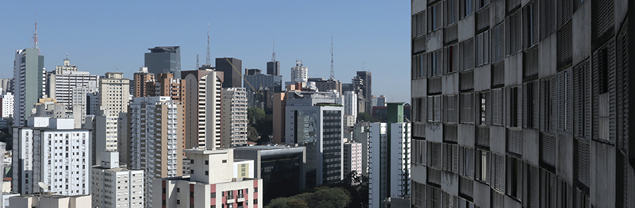
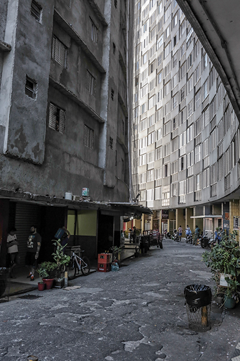
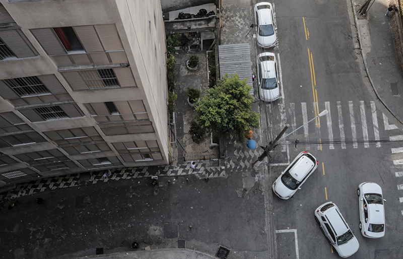
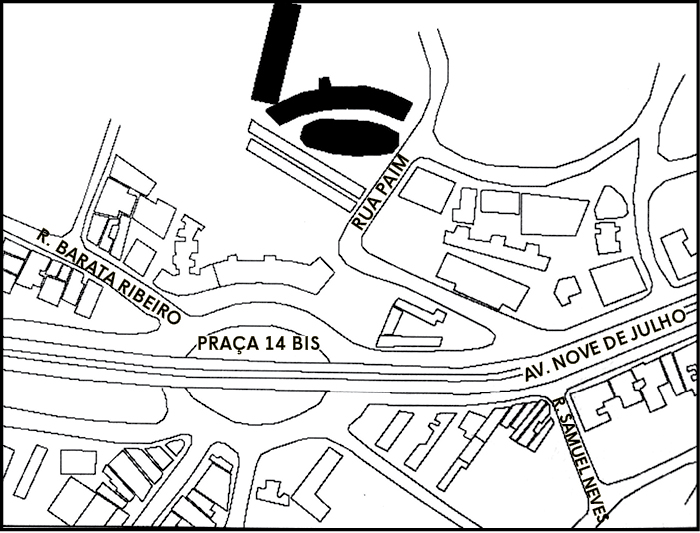
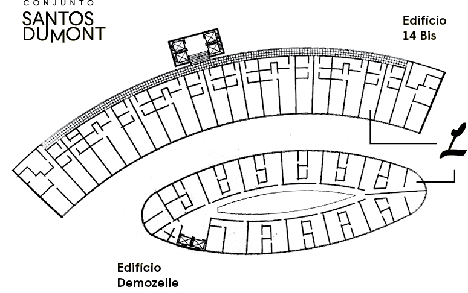
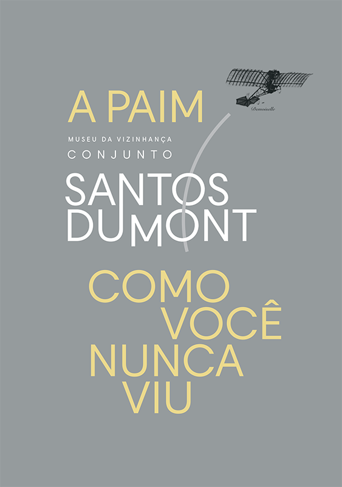
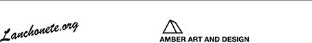

O Museu da Vizinhança Conjunto Santos Dumont é um espaço de trabalho, exposição e eventos, que celebra as histórias, movimentos e realidades vividas nestes três prédios icônicos, assim como em seu entorno da rua Paim que está mudando rapidamente. Lanchonete.org engaja membros da comunidade do Bixiga por meio do intercâmbio de histórias orais e visuais, oficinas de arte, projeções de filmes, assim como refeições e encontros comunitários. Como um coletivo de pensadores urbanos, chamamos artistas do Brasil e de outras partes do mundo como convidados para reformatar continuamente e desenhar esse espaço em transformação. O seu envolvimento será bem-vindo.

//

 

_The Conjunto Santos Dumont Neighborhood Museum is an open exhibition, event and work space that commemorates the histories, transitions, and lived realities in these three iconic buildings and the rapidly changing area around Rua Paim. Lanchonete.org engages members of the Bixiga community through the sharing of oral and visual histories, art workshops and film screenings, community meals and gatherings. As a collective of urban thinkers, we invite guest artists from Brazil and other parts of the world to continually re-shape and design this evolving space. We welcome your involvement._

Rua Paim, 211 ap. 1023 - Edifício Demozelle

 

