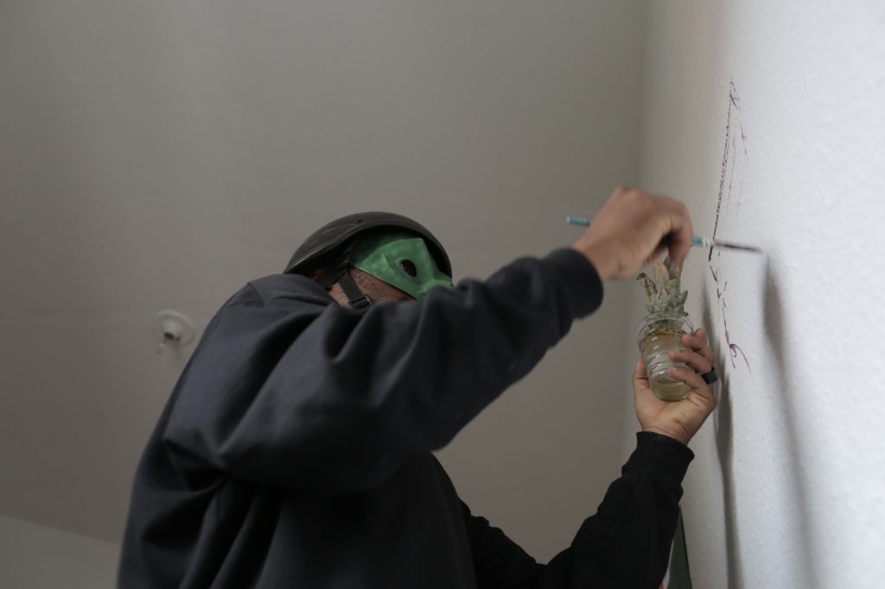

Na ocasião do Dia da Consciência Negra, o tradicional Almoço de Segundas no Museu da Vizinhança se voltou à temática, e ocorreu em torno de debates levantados pelo Coletivo Amem. Na cozinha, as delícias dos queridos Jonas Van e Abdoulaye Guibila.

\[portfolio\_slideshow size=full\]

fotos ©Leandro Moraes

  
—

 O artista Dig Ferreira esteve em residência conosco durante o período de setembro-dezembro de 2017.

foto ©Leandro Moraes
