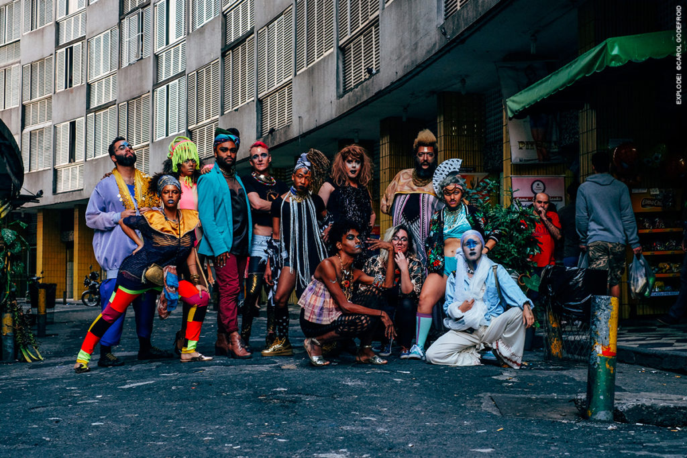

Durante o ano, muitas vezes tivemos visitas que passaram rapidamente pela Paim, gerando uma série de "Encontros na Paim." Os encontros foram momentos informais de se sentar junto e discutir o passado e futuro do projeto, com o compartilhamento da experiência e projetos/pesquisas de diferentes visitantes de fora que estavam de passagem pela cidade.

**UMLILO & STASH CREW + EXPLODE!** - abril de 2017 

foto: Explode!/ ©Carol Godefroid

 

* * *

**VANESSA ANDREOTTI** - maio de 2017

Vanessa Andreotti atualmente é professora titular da Cátedra de Pesquisa Canadense em questões relacionadas à globalização, desigualdades e transformações sociais através da educação e professora associada efetiva do Departamento de Estudos Educacionais da Faculdade de Educação, na Universidade de British Columbia em Vancouver, no Canadá.

\[portfolio\_slideshow exclude="325,326,327,328,329,569"\]

fotos ©Leandro Moraes

 

* * *

**KEIR & KADIJA** - setembro de 2017 \[portfolio\_slideshow exclude="220,221,225,332,336,337,338,569"\]

fotos ©Leandro Moraes
