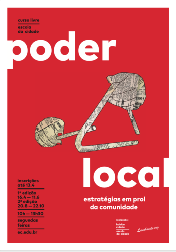

Membros da equipe do Lanchonete.org, em parceria com a Escola da Cidade, decidiram manter o Museu da Vizinhança (localizado em um apartamento no prédio Demoiselle, noConjunto Santos Dumont) aberto durante alguns meses após seu encerramento oficial, decidindo usar o espaço como local de encontro regulares para a aula aberta "Poder Local", também dando continuação aos almoços de segunda do Chef Abdoulaye.

_Members of the Lanchonete.org team, in partnership with Escola da Cidade, decided to keep the Neighborhood Museum (located in an apartment in the Demoiselle building, in the Santos Dumont Compound) open for a few more months after its official end, deciding to use the space as a meeting place for the regular open course "Local Power", also continuing Chef Abdoulaye's Monday lunches._

[lanchonete.org](http://lanchonete.org/2018/09/programacao-de-encerramento/)
